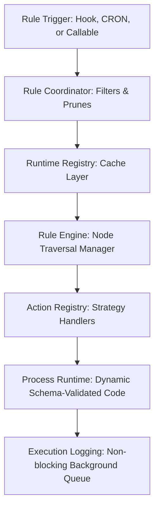

<div align="center">
  <picture>
    <source media="(prefers-color-scheme: dark)" srcset="assets/logo-dark.svg">
    
  </picture>

  <h1>FlexiRule</h1>

[](https://github.com/Sendipad/flexirule/actions/workflows/ci.yml?query=branch%3Adevelop)


  <p><strong>Declarative Business Automation & Visual Orchestration Platform for Frappe and ERPNext</strong></p>

</div>

<div align="center">
  
  <p>
    <em>The visual, graph-based canvas serves as the single source of truth for your business workflows.</em>
  </p>
</div>

---

## 🚀 Overview

In enterprise systems built on **Frappe** and **ERPNext**, business logic frequently turns into a fragmented web of Python hooks scattered across custom apps. This unstructured approach introduces several challenges:

* **Implicit Ordering**: It is difficult to determine which hook executes first, leading to unpredictable side effects.
* **Lack of Observability**: Debugging execution paths and tracing runtime failures is complex.
* **High Upgrade Risk**: Heavy dependency on internal API paths increases maintenance overhead.
* **Silent Failure States**: Uncaught errors can leave database transactions in an inconsistent state.

**FlexiRule** changes the paradigm by providing a **visual, graph-based orchestration layer**. Rather than spreading hidden code across your system, you design, validate, and execute declarative business logic with full control, complete observability, and built-in transaction safety.

---

## ⚖️ Why Not Server Scripts?

| Traditional Hooks / Server Scripts | FlexiRule |
| :--- | :--- |
| **Scattered Python Code** | **Centralized Rules**: View all business rules from a single, auditable dashboard. |
| **Hidden Execution Order** | **Visual Graph**: Connections define clear, deterministic execution paths on canvas. |
| **Hard to Debug** | **Execution Tracing**: Real-time trace lines highlight the exact path and state of each node. |
| **Duplicate Logic** | **Reusable Processes**: Package core logic once and share it securely across multiple rules. |
| **Manual Forms & Controls** | **Schema-Driven UI**: Forms and fields auto-generate from standard JSON schemas. |
| **Difficult Governance** | **Built-in Safety**: Advanced sandboxing, role exclusions, and permission audits. |

---

## 💎 Why FlexiRule?

FlexiRule provides a modern, structured alternative to scattered custom hooks:

* **Centralized Logic**: Consolidate your business rules into a single, auditable dashboard instead of maintaining custom hooks across multiple repositories.
* **Deterministic Orchestration**: Define clear execution paths using direct visual connections, resolving hook execution ordering issues.
* **Safe Sandboxed Evaluation**: Evaluates condition checks in a read-only environment using a sandboxed API, preventing accidental state changes during criteria checks.
* **Schema-Driven UI**: Forms and configuration panels are auto-generated from dynamic schemas, providing developers with structured inputs and validations.
* **Enterprise Governance**: Includes built-in execution safeguards, including savepoint-based transaction rollbacks, role-based execution bypasses, and permission audit logs.

---

## 🖼️ Visual Tour

<details>
<summary><strong>View Visual Walkthrough</strong></summary>

<br/>
<div align="center">
  
  <p><em>Centralized Rule Management Interface for filtering and managing active flows.</em></p>

  
  <p><em>Declarative condition tree builder with nested AND/OR evaluation.</em></p>

  
  <p><em>VueFlow Rule Builder with drag-and-drop node configurations and topological routing.</em></p>

  
  <p><em>Real-time execution path tracing and state tracing directly on the canvas.</em></p>

  
  <p><em>Query node configuration for introspecting fields, mapping inputs, and filtering database records.</em></p>

  
  <p><em>Batch assignment step supporting multi-operator mutations on document fields and context variables.</em></p>

  
  <p><em>Flexible notifications supporting toasts, system alerts, or standard emails.</em></p>

  
  <p><em>Process Operations for running file-backed custom code with schema-driven inputs.</em></p>
</div>

</details>

---

## 🧠 Core Concepts

FlexiRule separates trigger criteria, execution paths, and business logic into structured components:

* **Rule**: The entry point that defines *when* execution should trigger, binding to DocType database hooks, background scheduler intervals, or manual callable events.
* **Action Type**: Reusable visual action definitions declaring layout styles, required parameters, and outcome capabilities.
* **Rule Action**: A specific step (node) in the execution graph that processes input configurations and routes control to successor nodes based on execution outcomes.
* **Process**: A file-backed Python module that acts as a secure, performance-optimized container for custom code. Processes are highly reusable across multiple rules, allowing developers to share critical business logic instead of duplicating it.
* **Operation**: An individual function within a Process that exposes its parameters through a declarative JSON Schema.
* **Runtime Context**: An isolated execution namespace carrying the root document, context variables, and metadata.
* **Execution Graph**: The topologically ordered sequence of steps representing your business workflow.

---

## 🛠️ Key Features

* **Visual Rule Builder**: Drag, drop, and connect steps with automatic topological sorting to organize your workflows easily.
* **No-Code Configuration**: Custom UI controls let you set up complex database queries, field assignments, and operations without writing code.
* **Deterministic Execution**: Run logic along explicit paths with built-in loop limits to guarantee safe, infinite-recursion-free routing.
* **Rule Simulation**: Test your rules safely using a dry-run mode that evaluates criteria, traces execution paths, and rolls back transaction changes.
* **Runtime Debugging**: Gain complete observability with real-time execution path tracing, detailed state snapshots, and error traces.
* **Process Reusability**: Bundle core logical routines into reusable file-backed Processes, allowing them to be shared across multiple active rules.
* **Extensible Action Types**: Expand the platform easily with custom action types to connect with external systems and services.
* **Enterprise Safety**: Restrict rule executions by user roles, bypass permissions with mandatory audit reasons, and handle errors with safe database savepoint rollbacks.
* **High-Performance Runtime**: Designed for zero-overhead event execution through layered metadata caching, pre-compiled condition strings, and watched-field pruning.

### 💻 Developer Experience (DX)

* **Schema-Driven UI**: Configuration panels and forms are automatically generated from standard JSON schemas, ensuring perfect alignment between frontend controls and backend data.
* **Dynamic Control Factory**: Automatically renders standard Vue 3 form inputs, link autocompletes, and collection controls based on dynamic parameters.
* **Custom UI Controls**: Embed customized input widgets or advanced data selectors directly into action configurations.

---

## 🏗️ Architecture Overview

FlexiRule decouples event-driven triggers from execution mechanics and business logic processing:



### Component Responsibilities

* **Rule Trigger**: Binds database lifecycle events, scheduler intervals, or programmatic calls to start execution.
* **Rule Coordinator**: Resolves active rules and performs early eligibility pruning using pre-compiled conditions.
* **Runtime Registry**: Caches compiled runtime metadata to minimize database access during event hooks.
* **Rule Engine**: Traverses the execution graph topologically, manages context state, and handles retry and transaction boundaries.
* **Action Registry**: Maps individual execution steps to their respective strategy implementations (e.g., Conditions, Assignments, Loops).
* **Process Runtime**: Orchestrates custom processes, maps context variables, and validates configurations against JSON schemas.
* **Execution Logging**: Persists detailed execution traces asynchronously to keep user transactions fast and lightweight.

---

## 🔄 Execution Lifecycle

The following diagram illustrates how FlexiRule coordinates execution, from event matching to transaction completion:


The execution flow begins with **Rule Discovery** and optimizes database performance via **Watched Fields**. If checked fields have changed, the pre-compiled criteria are evaluated in a read-only sandboxed environment. Upon passing, an isolated **Runtime Context** is initialized, and nodes are executed topologically. Errors are caught and handled according to the node's configured policy (`Retry`, `Continue`, `Rollback` to savepoint, or `Stop`). Once the path is completed, audit logs are pushed to an asynchronous background worker before the transaction commits.

---

## ⚡ Performance Architecture

FlexiRule is engineered for high throughput to ensure database transaction event loops remain fast and lightweight:

* **Runtime Registry Cache**: Rule metadata and structures are cached in a dedicated Redis registry (`flexirule_runtime_registry_v2`). The platform avoids expensive SQL operations by bypassing database queries during event hooks.
* **Watched Fields Optimization**: Event listeners analyze changed fields first. If a modified database field does not overlap with fields evaluated by the rule, execution is pruned immediately before compiling criteria.
* **Compiled Expressions**: Visual condition trees are pre-compiled into optimized Python expressions on Rule save, facilitating fast, single-pass evaluations.
* **Action Plan Caching**: Compiled execution actions and strategy plans are cached locally to eliminate parsing overhead during runtime execution.
* **Asynchronous Execution Log Persistence**: Logging and heavy notification tasks are enqueued to background workers (`short` / `default` queues), removing them from the critical request path.
* **Minimal Database Lookups**: State variables and resolved inputs are stored exclusively in the in-memory execution context, avoiding redundant database lookups.

---

## 🔌 Extensibility Model

Developers can extend FlexiRule at multiple layers to integrate custom business logic:

* **Action Types**: Custom execution blocks can be registered to provide reusable, platform-wide capabilities (e.g., custom integrations or formatters).
* **Processes & Operations**: Package custom logic into file-backed Python classes. FlexiRule automatically discovers these methods, letting you expose inputs through standard JSON schemas that automatically render as validated forms in the UI.
* **Dynamic Config Schemas**: Define dynamic layout fields, allowing the builder UI to generate user-friendly configuration panels on the fly.
* **Custom UI Controls**: Wire custom controls directly into action properties, supporting advanced data selectors and interactive widgets.

---

## 📬 API Reference

FlexiRule exposes a clean suite of whitelisted endpoints to programmatically manage, test, and execute rules:

* **`execute_rule(rule, context, dry_run)`**: Run a rule on a document manually, with options for sandboxed dry-runs.
* **`simulate_rule(rule_name, docname)`**: Run a sandboxed execution that rolls back database changes and returns the exact execution path trace and state updates.
* **`test_rule(rule_name, docname, save_log)`**: Programmatically test a rule and verify its outcomes.
* **`get_execution_preview(rule_name, docname)`**: Predict node traversal routes based on current field values without triggering state mutations.
* **`transition_rule(rule_name, target_status)`**: State machine transition for rules between `Draft` and `Active` states.
* **`get_contract_dto(action_type)`**: Retrieve active layouts, parameters, and contracts for active action types.
* **`get_node_config_schema(action_type, process, operation)`**: Generate dynamic UI form configurations from custom parameters.
* **`get_action_context_schema(rule_name, action_id)`**: Inspect the context variables available at a specific graph step.

---

## 📦 Installation

```bash
# Get the app from the repository
bench get-app flexirule https://github.com/Sendipad/flexirule.git

# Install to your target site
bench --site [your-site] install-app flexirule
```

---

## 🤝 Contributing

Contributions are welcome! If you are interested in improving FlexiRule, please consider:

* Opening a **Bug Report** or submitting a **Feature Request** on GitHub.
* Improving documentation or writing custom Process Operations.
* Submitting a **Pull Request** with bug fixes or optimizations, ensuring you follow [Frappe Coding Guidelines](https://frappeframework.com/docs/v15/user/en/guidelines/coding-standards) and confirm that all tests pass.

---

<div align="center">
  
  <p><strong>FlexiRule</strong> — Declarative, Visual, and Safe Business Logic for Frappe.</p>
  <p>Built with ❤️ by the community. Distributed under the MIT License.</p>
</div>
