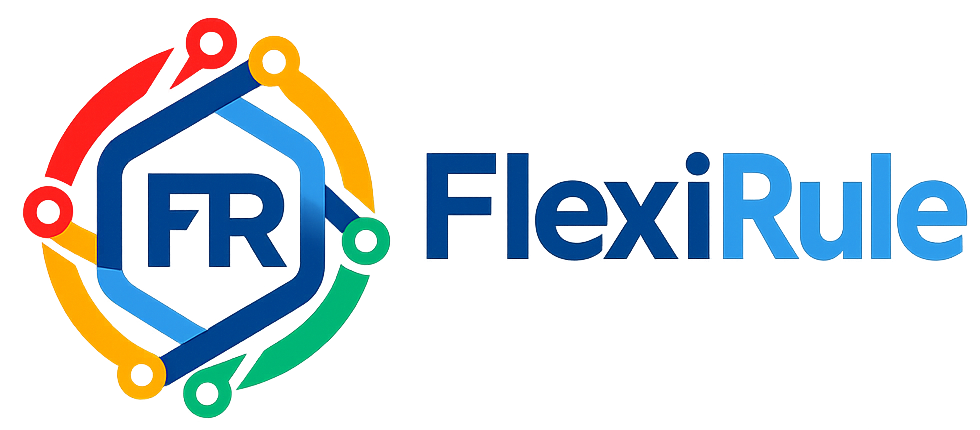

 HEAD
# FlexiRule



## Enterprise-Grade Rule Engine & Data Quality Framework for Frappe / ERPNext

<div align="center">
  
  <h1>FlexiRule</h1>
  <p><b>Advanced Rule & Orchestration Engine for the Frappe Framework</b></p>
</div>

---

**FlexiRule** is a powerful, graph-based rule engine designed for Frappe/ERPNext. It allows you to build complex logic flows, validations, data enrichment, and deduplication checks dynamically without writing custom code for every scenario. Rules are defined visually (as graphs) and executed efficiently via a robust Python engine.

## 🌟 Key Features

*   **Graph-Based Logic Flows**: define rules as a sequence of connected nodes (Conditions, Processes, Loops).
*   **Reusable Process Methods**: Library of pre-built methods for **Deduplication**, **Validation**, **Enrichment**, and **Notification**.
    *   **High-Performance Deduplication**: Integrated with [rapidfuzz](cci:1://file:///home/erpnext/frappe-bench/apps/flexirule/flexirule/ruleflow/methods/deduplication.py:18:0-24:25) for fast fuzzy matching and blocking.
    *   **Data Enrichment**: Calculate fields, fetch values from linked docs, or apply naming series dynamically.
*   **Visual Rule Builder**: Drag-and-drop interface to design your business logic.
*   **Robust Execution Engine**:
    *   **Safety First**: Sandboxed Python evaluation for conditions ([SafeFrappeAPI](cci:2://file:///home/erpnext/frappe-bench/apps/flexirule/flexirule/ruleflow/core/engine.py:48:0-125:69)).
    *   **Resilience**: Built-in **Retry** mechanisms with exponential backoff on failure.
    *   **Timeout Protection**: Prevents infinite loops or long-running processes.
    *   **Cycle Detection**: Automatically detects and prevents infinite graph cycles.
*   **Role-Based Security**: Skip rule execution based on User Roles.
*   **Monitoring & Debugging**: Detailed execution logs, error tracking, and performance statistics for every rule.

## 📦 Installation
 68879cb (Fieldname Standarized)

FlexiRule is a fully extensible, no-code / low-code rule engine designed to replace hard-coded business logic in ERPNext.  
Instead of embedding conditions and validations inside Python hooks, FlexiRule allows you to define **Rules**, **Actions**, and **Process Methods** that execute dynamically based on document events.

 HEAD
This project represents the evolution of **UPH → Business Rule Hub → Bolton → FlexiRule**, now offering a cleaner, standardized, and scalable architecture.

---

## 🚀 Key Features

- **Graph-Based Execution**  
  Build complex logic flows using a graph of rule actions.

- **Process Methods**  
  Pluggable functional units written in Python and fully configurable via JSON schemas.

- **No-Code Configuration**  
  The UI auto-generates configuration forms based on each method’s schema.

- **Data Quality Tools**  
  Built-in deduplication (fuzzy / exact matching), normalization, and child-table scanning.

- **Safe Execution**  
  Timeout-controlled execution with centralized error handling.

- **Extensible Architecture**  
  Easily add or extend Process Methods without changing core logic.

---

## 🏗️ Architecture

FlexiRule is built around three core DocTypes:

1. **Rule**  
   Defines the trigger DocType, event, and optional filters.

2. **Rule Action**  
   Represents a single step in the execution graph and links to a Process Method.

3. **Process Method**  
   A Python function that performs logic and exposes a configuration schema.

```mermaid
graph LR
    Trigger[Rule Trigger]
    --> Action1[Action: Validate]
    Action1 -->|Success| Action2[Action: Check Duplicates]
    Action1 -->|Fail| Stop[Stop Execution]
    Action2 -->|Found| Action3[Action: Block Save]
    Action2 -->|None| Action4[Action: Enrich Data]
=======
```bash
cd $PATH_TO_YOUR_BENCH
bench get-app flexirule
bench install-app flexirule
 68879cb (Fieldname Standarized)
