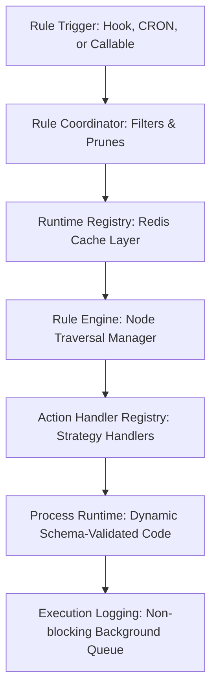
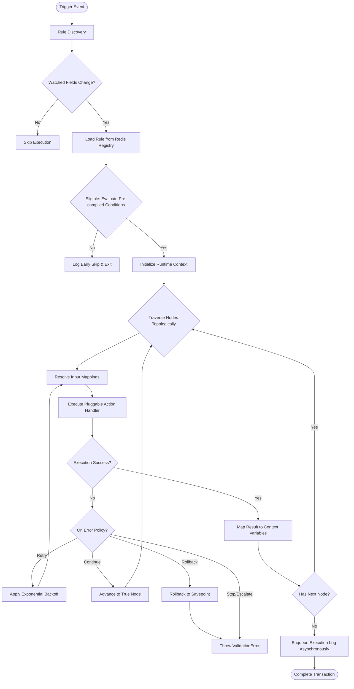

<div align="center">
  

  <h1>FlexiRule</h1>

[](https://github.com/Sendipad/flexirule/actions/workflows/ci.yml?query=branch%3Adevelop)


  <p><strong>Declarative Business Automation & Visual Orchestration Platform for Frappe and ERPNext</strong></p>

</div>

<div align="center">
  
  <p>
    <em>The VueFlow-based Visual Rule Builder is the single source of truth: designed flows correspond directly to the executed business logic graph.</em>
  </p>
</div>

---

## 🚀 Overview

In modern enterprise applications built on **Frappe** and **ERPNext**, business logic frequently turns into a fragmented web of Python hooks scattered across custom apps. This unstructured approach introduces several challenges:

* **Implicit Ordering**: It is difficult to determine which hook executes first or last.
* **Lack of Observability**: Debugging execution paths and tracing runtime failures is complex.
* **High Upgrade Risk**: Heavy dependency on internal API paths increases maintenance overhead.
* **Silent Failure States**: Uncaught errors and hidden side effects can leave database transactions in an inconsistent state.

**FlexiRule** addresses these issues by providing a **visual, graph-based orchestration layer**. Rather than spreading hidden code across your system, you design, validate, and execute declarative business logic with full control, complete observability, and built-in transaction safety.

---

## 💎 Why FlexiRule?

FlexiRule provides a modern, structured alternative to scattered Server Scripts and ad-hoc custom hooks:

* **Centralized Logic**: Consolidate your business rules into a single, auditable dashboard instead of maintaining custom `.py` hooks across multiple repositories.
* **Deterministic Orchestration**: Define clear execution paths using direct visual connections. Visual execution boundaries resolve hook ordering issues.
* **Safe Sandboxed Execution**: Runs condition checks in a read-only environment using a sandboxed API, preventing accidental state changes during criteria evaluations.
* **Schema-Driven UI**: Automatically generates configuration panels from dynamic schemas, providing developers with structured inputs, auto-completions, and validations.
* **Robust Enterprise Governance**: Includes built-in execution safeguards, including savepoint-based transaction rollbacks, role-based execution bypasses, and permission audit logs.

---

## 🖼️ Visual Tour

<details>
<summary><strong>View Visual Walkthrough</strong></summary>

<br/>
<div align="center">
  
  <p><em>Centralized Rule Management Interface: Filter and manage execution rules by trigger type and status.</em></p>

  
  <p><em>Condition Node Configuration: Declarative, deeply nested condition trees with deterministic evaluation.</em></p>

  
  <p><em>VueFlow Rule Builder: Drag, drop, and connect steps with automatic topological routing.</em></p>

  
  <p><em>Real-Time Execution Debugger: Trace execution paths and variable modifications across connected nodes.</em></p>

  
  <p><em>Query Node Configuration: Introspect fields, map inputs, and filter data with a visual query designer.</em></p>

  
  <p><em>Custom Assignment: Perform batch mutations on document fields and context variables using mathematical, text, and formatter operators.</em></p>

  
  <p><em>Notification Actions: Configure toasts, system alerts, or standard emails using jinja-rendered templates.</em></p>

  
  <p><em>Process Operations: Execute file-backed Python operations with schema-driven inputs and custom return types.</em></p>
</div>

</details>

---

## 🧠 Core Concepts

FlexiRule separates trigger criteria, execution paths, and business logic into structured components:

* **Rule**: The entry point. A Rule specifies *when* execution should trigger. It binds to a context source:
  * *DocType Event*: Executed during database transaction hooks (e.g., `Before Save`, `On Submit`).
  * *Scheduler Event*: Background, CRON-based schedules.
  * *Callable Event*: Exposed as an isolated subroutine for parent workflows.
* **Action Type**: Reusable visual action definitions. An Action Type declares visual layout components, mandatory fields, allowed return types, and expected mutations.
* **Rule Action**: A specific step (node) in the execution graph. Each Action processes input configurations and routes control to the next node based on its outcome.
* **Process**: A file-backed Python module acting as a container for reusable business logic. This allows developers to maintain performance-critical logic in git-tracked code.
* **Operation**: An individual function within a Process. It exposes its parameters through a declarative JSON Schema, which FlexiRule translates into dynamic configuration inputs in the UI.
* **Runtime Context**: The isolated execution environment namespace. It maintains the root document instance (`doc`), isolated variables (`vars`), execution metadata, and current loop indexes.
* **Execution Graph**: The connected sequence of nodes. Evaluated topologically, this graph ensures a deterministic sequence of execution without ordering ambiguity.

---

## 🏗️ Architecture Overview

The framework separates visual layout representation from backend database execution:



### Component Responsibilities

1. **Rule Trigger**: Capture database lifecycle hooks, scheduler intervals, or manual calls to bootstrap execution.
2. **Rule Coordinator**: Evaluates eligibility criteria and prunes rules early using pre-compiled conditions.
3. **Runtime Registry**: A Redis-backed cache storing active rule definitions and dependency mappings to minimize database queries.
4. **Rule Engine**: Manages topological graph traversal, maintains state variables, handles retries, and enforces transaction isolation boundaries.
5. **Action Handler Registry**: Translates execution steps to their respective strategy implementations (e.g., Conditions, Assignments, Loops).
6. **Process Runtime**: Standardizes parameter validation and maps variables for standard processes.
7. **Execution Logging**: Persists detailed execution path traces and state changes asynchronously using a non-blocking background queue.

---

## 🔄 Execution Lifecycle

The following diagram illustrates the complete execution lifecycle of a rule execution, including error recovery paths and transaction boundaries:



---

## 🛠️ Key Features

The capabilities of FlexiRule are organized into five key areas:

### 🎨 Visual Builder
* **VueFlow Graph Canvas**: An interactive node-based interface for drag-and-drop workflow configuration.
* **Visual Undo/Redo Engine**: Pinia-backed state tracking for quick reversion and visual correction.
* **Path Prediction and Dry-run Simulation**: Run sandboxed dry-runs to inspect execution path traces in real-time.
* **Visual Nesting**: Build nested AND/OR criteria groups with the dynamic Condition Tree Builder.

### ⚙️ Traversal & Execution
* **Strategy Pattern Handlers**: Clean Separation of concerns across and pluggable action strategy handlers.
* **Robust Error Policies**: Out-of-the-box support for `Retry` (with exponential backoff), `Continue`, `Rollback` (via db savepoints), and `Escalate` error behaviors.
* **Deterministic Traversal**: Visit-counted graph routing preventing infinite recursion loops.
* **Copy-On-Write Variables**: Thread-safe context variables during sub-rule execution via namespaced context variables.

### ⚡ Performance Optimizations
* **Watched Fields Optimization**: Automatic extraction of target fields from condition strings. The Rule Coordinator prunes rule executions early if the mutated fields do not overlap with the rule's active fields.
* **Layered Cache Store**: Avoids DB lookups by maintaining a Redis-backed registry mapped by DocType and event.
* **Jinja & Expression Compilation**: Condition JSON configurations compile into flat, single-pass Python condition expressions on Rule save.
* **Asynchronous Execution Log Persistence**: Non-blocking enqueuing of audit logs to keep user transactions fast.

### 🛡️ Security & Enterprise Governance
* **Sandboxed SafeFrappeAPI**: Restricts condition checks to read-only database queries, preventing accidental data writes during evaluation.
* **Rule-Based Execution Controls**: Set explicit rule-level exclusions (`skip_for_roles`) to bypass workflows for specific roles.
* **Permission Audit Logs**: Tracks occurrences where normal user permissions were bypassed, requiring an audit reason.

### 💻 Developer Experience
* **Dynamic Control Factory**: Schema-driven UI forms automatically rendered from standard JSON-schema definitions.
* **Standard Custom Processes**: Standard processes generate boilerplate python and javascript controllers in custom apps.

---

## ⚡ Performance Architecture

FlexiRule is designed to maintain high performance when processing database events:

* **Redis Runtime Registry**: On save, rules compile into lightweight schemas stored in a shared Redis cache (`flexirule_runtime_registry_v2`). The framework bypasses database queries during active event hooks.
* **Watched Fields Pruning**: Event listeners only execute if a modified database field matches a field explicitly evaluated by the rule. Unmatched field changes are discarded before rule evaluation begins.
* **Pre-compiled Condition Strings**: Rather than parsing JSON trees at runtime, condition nodes are pre-compiled into optimized Python expressions, allowing for fast, single-pass evaluations.
* **Asynchronous Background Workers**: Offload heavy notifications and non-blocking logging tasks to background queues (`short` / `default`), keeping the main request thread fast.

---

## 🔌 Extensibility Model

Developers can extend FlexiRule at multiple layers to integrate custom business logic:

### 1. Custom Action Types
Developers can register custom action types by extending the abstract `ActionHandler` strategy class:

```python
from flexirule.ruleflow.core.action_handlers import ActionHandler, HandlerRegistry

class SMSNotificationHandler(ActionHandler):
    action_type = "SMS Notification"

    def execute(self, action, context, engine):
        config = engine._get_action_config(action)
        phone = self._resolve_value_expression(config.get("phone"), context)
        message = self._render_template(action.value_template, context)

        # SMS sending implementation...
        return {"sms_status": "sent"}, action.next_step_if_true

# Register the strategy handler
HandlerRegistry.register(SMSNotificationHandler())
```

### 2. File-Backed Processes & Operations
For complex, performance-critical logic, create standard Processes. FlexiRule automatically discovers decorated python methods:

```python
# My custom app: processes/order_processing.py
import frappe

class OrderProcessingProcess:
    def reserve_stock(self, context, config):
        """
        Reserve stock for order items.
        Automatically validated against input/output JSON schemas.
        """
        # Custom logic implementation...
        return {"reserved_count": 5}
```

Expose parameters using standard **JSON Schema** configuration fields. The Dynamic Control Factory in the frontend translates these definitions into auto-validated configuration forms.

---

## 📬 Whitelisted API Reference

FlexiRule provides whitelisted backend methods to interact with the execution engine:

* **`execute_rule(rule_name, docname, vars)`**: Manually run a rule on a document.
* **`simulate_rule(rule_name, docname)`**: Perform a dry-run execution that rolls back transactions and returns execution path details.
* **`transition_rule(rule_name, target_status)`**: Transition rules between `Draft` and `Active` states.
* **`get_execution_preview(rule_name, docname)`**: Predict node traversal based on a document's current field values.
* **`get_contract_dto(action_type)`**: Retrieve frontend-safe layout constraints and capabilities for schema validation.
* **`get_node_config_schema(action_type, process, operation)`**: Generate configuration forms from custom JSON schemas.
* **`get_action_context_schema(rule_name, action_id)`**: Inspect execution variables at a specific graph step.

---

## 📦 Installation

```bash
# Get the app from the repository
bench get-app flexirule https://github.com/Sendipad/flexirule.git

# Install to your target site
bench --site [your-site] install-app flexirule

# Build compiled assets
bench build --app flexirule
```

---

## 🤝 Contributing

Contributions are welcome! If you are interested in improving FlexiRule, please consider:

* Opening a **Bug Report** or submitting a **Feature Request** on GitHub.
* Improving documentation or writing custom Process Operations.
* Submitting a **Pull Request** with bug fixes or optimizations, ensuring you follow [Frappe Coding Guidelines](https://frappeframework.com/docs/v15/user/en/guidelines/coding-standards) and confirm that all tests pass.

---

<div align="center">
  
  <p><strong>FlexiRule</strong> — Declarative, Visual, and Safe Business Logic for Frappe.</p>
  <p>Built with ❤️ by the community. Distributed under the MIT License.</p>
</div>
