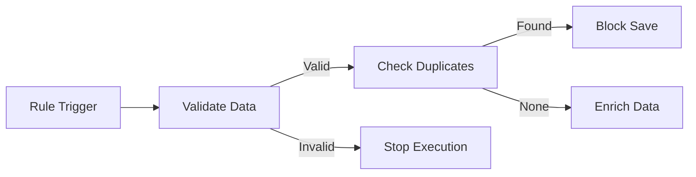

<div align="center">
  
  <h1>FlexiRule</h1>
  <p><b>Advanced Rule & Orchestration Engine for the Frappe Framework</b></p>
</div>

---

**FlexiRule** is a powerful, graph-based rule and orchestration engine for **Frappe / ERPNext**. It enables you to design complex business logic—validations, deduplication, enrichment, and orchestration—**visually**, without hard‑coding logic into Python hooks.

Rules are modeled as **graphs of actions**, executed by a robust and safe Python engine with full observability and control.

---

##  Key Features

* **Graph‑Based Logic Flows**
  Define rules as connected nodes (Conditions, Processes, Loops, Decisions).

* **Reusable Process Methods**
  A growing library of configurable methods for:

  * **Deduplication** (exact & fuzzy)
  * **Validation**
  * **Data Enrichment**
  * **Notifications & Blocking**

* **High‑Performance Deduplication**
  Integrated fuzzy matching with blocking strategies for large datasets.

* **Visual Rule Builder**
  Drag‑and‑drop UI to design and connect rule actions.

* **Robust Execution Engine**

  * Sandboxed and safe condition evaluation
  * Retry support with exponential backoff
  * Timeout protection for long‑running rules
  * Automatic cycle detection to prevent infinite loops

* **Role‑Based Execution Control**
  Skip or allow rule execution based on user roles.

* **Monitoring & Debugging**
  Execution logs, error tracking, and performance statistics per rule run.

---

## Why FlexiRule?

Traditional ERPNext customizations rely heavily on Python hooks scattered across apps, which makes logic:

* Hard to audit
* Difficult to change
* Risky to deploy

**FlexiRule centralizes and standardizes business logic** into a declarative, versionable, and visual system.

This project represents the evolution of:

**UPH → Business Rule Hub → Bolton → FlexiRule**

with a cleaner, standardized, and scalable architecture.

---

## Core Concepts

FlexiRule is built around three primary DocTypes:

###  Rule

Defines:

* Target DocType
* Trigger Event (validate, before_save, after_insert, etc.)
* Optional filters and role conditions

The Rule acts as the **entry point** of execution.

---

### Rule Action

Represents a **node** in the execution graph.

Each action:

* Links to a Process Method
* Has configurable inputs
* Defines next actions based on outcomes (success, fail, match, no‑match, etc.)

---

###  Process Method

A Python function that:

* Performs a unit of logic
* Exposes a **JSON schema** describing its configuration
* Is reusable across multiple rules

The UI auto‑generates configuration forms from the schema.

---


## Visual Interface
### Rule Builder
The core of FlexiRule is its visual builder, allowing you to design logic flows with ease.

<details>
<summary><b>View More Screenshots</b></summary>
*Coming soon: More screenshots of Process Method configuration and Execution Logs.*
</details>
---
## Execution Flow (Example)



---

##  Installation

```bash
cd $PATH_TO_YOUR_BENCH
bench get-app flexirule
bench install-app flexirule
```

Restart bench after installation.

---

## Extensibility

FlexiRule is designed to be extended **without modifying core code**.

You can:

* Add new Process Methods
* Extend schemas for existing methods
* Override execution behavior via hooks

This makes FlexiRule suitable for **enterprise‑grade customizations**.

---

##  Safety & Stability

* Sandboxed execution context
* Controlled retries and timeouts
* Centralized exception handling
* Safe evaluation of user‑defined conditions

FlexiRule prioritizes **data integrity and system stability**.

---

## Status

* Active development
* API and data model stabilizing
* Backward‑compatibility enforced once v1 contract is finalized

---

## Contributing

Contributions, ideas, and feedback are welcome.

Please:

* Open issues for bugs or feature requests
* Submit PRs with clear descriptions
* Follow Frappe coding standards

---

**FlexiRule** — Declarative, Visual, and Safe Business Logic for Frappe.
