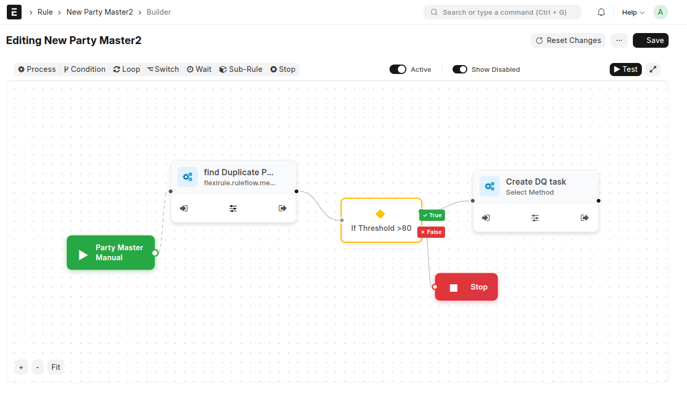

<div align="center">


<h1>FlexiRule</h1>

<strong>Visual Rule & Orchestration Engine for Frappe / ERPNext</strong>

<br/>



<p align="center">
  <em>The Visual Rule Builder is the canonical representation of FlexiRule logic — what you see is exactly what executes.</em>
</p>

</div>

<p>
<strong>FlexiRule</strong> enables the creation of <strong>deeply nested, visually composed rules</strong> out of the box, reflecting a strong commitment to a <strong>fully no-code rule builder and execution engine</strong>. Across the entire Rule Builder, we have developed <strong>custom UI controls</strong>—including single and multi-field pickers with intelligent autocomplete sourced from DocType metadata and runtime context variables—allowing users to configure complex logic without writing any code.
</p>

<details>
<summary><strong>View More Screenshots</strong></summary>

<br/>


<p align="center">
  <em>Each node is an instance of an action type with explicit, per-node configuration.</em>
</p> 


<p align="center">
  <em>Process Method — schema-driven configuration rendered dynamically.</em>
</p>


<p align="center">
  <em>Condition Builder — declarative, deeply nested condition trees with deterministic evaluation.</em>
</p>

</details>
---

## Overview

In the world of enterprise resource planning (ERP) systems, **Frappe / ERPNext** stands out for its flexibility and open-source nature. However, as systems scale, business logic often turns into a tangled web of Python hooks scattered across apps.

This leads to:
- Maintenance nightmares
- Debugging complexity
- Upgrade risks
- Poor visibility for non-developers

**FlexiRule** is a **visual, graph-based rule and orchestration engine** designed to centralize, standardize, and safely execute business logic in ERPNext.

Instead of writing and maintaining scattered hooks, you **design executable logic visually** — with full control, observability, and safety.

---

## What You’re Looking At

The screenshot above is **not documentation** and **not a mockup**.

It is the **actual runtime model** of FlexiRule.

- **Nodes** represent executable actions
- **Connections** define deterministic execution paths
- **The graph itself is the source of truth**

Saving the graph means deploying logic.

---

## Why FlexiRule Exists

Traditional ERPNext customization relies on event hooks like `validate`, `before_save`, or `after_insert`. While powerful, this approach introduces structural problems:

- **Fragmented Logic**  
  Rules spread across multiple files and apps are hard to audit and reason about.

- **Debugging Challenges**  
  Execution order is implicit, making failures difficult to trace.

- **Upgrade Risk**  
  Hooks often break silently during framework upgrades.

- **No Visibility**  
  Business users and admins cannot understand or modify logic safely.

FlexiRule is built from real-world experience evolving through:

**UPH → Business Rule Hub → Bolton → FlexiRule**

Each iteration moved closer to a **visual, contract-first, and safe execution model**.

---

## How FlexiRule Thinks (Mental Model)

FlexiRule is intentionally simple at its core.

### 1. Rule
The **entry point**.

Defines:
- Target DocType
- Trigger event (`validate`, `before_insert`, `after_save`, …)
- Optional filters and role conditions

---

### 2. Rule Action
A **node** in the execution graph.

Each action:
- References a Process Method
- Accepts structured configuration
- Defines next actions by outcome  
  (`success`, `fail`, `match`, `no-match`, …)

---

### 3. Process Method
A reusable Python function that:
- Performs one unit of logic
- Declares a JSON Schema for configuration
- Is safe, composable, and reusable

The UI auto-generates configuration forms directly from the schema.

---

## Visual Rule Builder (Core of FlexiRule)

The **Visual Rule Builder is the heart of FlexiRule**.

It is where:
- Rules are authored
- Execution paths are defined
- Business logic becomes explicit and auditable

### Key Properties

- The graph is **deterministic**
- Execution order is **explicit**
- Branching is **visible**
- No hidden behavior


## Execution Flow (Example)

```mermaid
graph LR
    Trigger[Rule Trigger]
    --> Validate[Validate Required Fields]
    Validate -->|Valid| Dedup[Check Duplicates]
    Validate -->|Invalid| Stop[Stop Execution]
    Dedup -->|Found| Block[Block Save]
    Dedup -->|None| Enrich[Enrich Data]
 ```
 * Automatic cycle detection to prevent infinite loops

* **Role‑Based Execution Control**
  Skip or allow rule execution based on user roles.

* **Monitoring & Debugging**
  Execution logs, error tracking, and performance statistics per rule run.

---

## Why FlexiRule?

Traditional ERPNext customizations rely heavily on Python hooks scattered across apps, which makes logic:

* Hard to audit
* Difficult to change
* Risky to deploy

**FlexiRule centralizes and standardizes business logic** into a declarative, versionable, and visual system.

This project represents the evolution of:

**UPH → Business Rule Hub → Bolton → FlexiRule**

with a cleaner, standardized, and scalable architecture.

---

## Core Concepts

FlexiRule is built around three primary DocTypes:

###  Rule

Defines:

* Target DocType
* Trigger Event (validate, before_save, after_insert, etc.)
* Optional filters and role conditions

The Rule acts as the **entry point** of execution.

---

### Rule Action

Represents a **node** in the execution graph.

Each action:

* Links to a Process Method
* Has configurable inputs
* Defines next actions based on outcomes (success, fail, match, no‑match, etc.)

---

###  Process Method

A Python function that:

* Performs a unit of logic
* Exposes a **JSON schema** describing its configuration
* Is reusable across multiple rules

The UI auto‑generates configuration forms from the schema.

---


## Execution Flow (Example)

```mermaid
graph LR
    Trigger[Rule Trigger]
    --> Action1[Validate Data]
    Action1 -->|Valid| Action2[Check Duplicates]
    Action1 -->|Invalid| Stop[Stop Execution]
    Action2 -->|Found| Action3[Block Save]
    Action2 -->|None| Action4[Enrich Data]
```

---

##  Installation

```bash
cd $PATH_TO_YOUR_BENCH
bench get-app flexirule
bench install-app flexirule
```

Restart bench after installation.

---

## Extensibility

FlexiRule is designed to be extended **without modifying core code**.

You can:

* Add new Process Methods
* Extend schemas for existing methods
* Override execution behavior via hooks

This makes FlexiRule suitable for **enterprise‑grade customizations**.

---

##  Safety & Stability

* Sandboxed execution context
* Controlled retries and timeouts
* Centralized exception handling
* Safe evaluation of user‑defined conditions

FlexiRule prioritizes **data integrity and system stability**.

---

## Status

* Active development
* API and data model stabilizing
* Backward‑compatibility enforced once v1 contract is finalized

---

## Contributing

Contributions, ideas, and feedback are welcome.

Please:

* Open issues for bugs or feature requests
* Submit PRs with clear descriptions
* Follow Frappe coding standards

---

**FlexiRule** — Declarative, Visual, and Safe Business Logic for Frappe.
