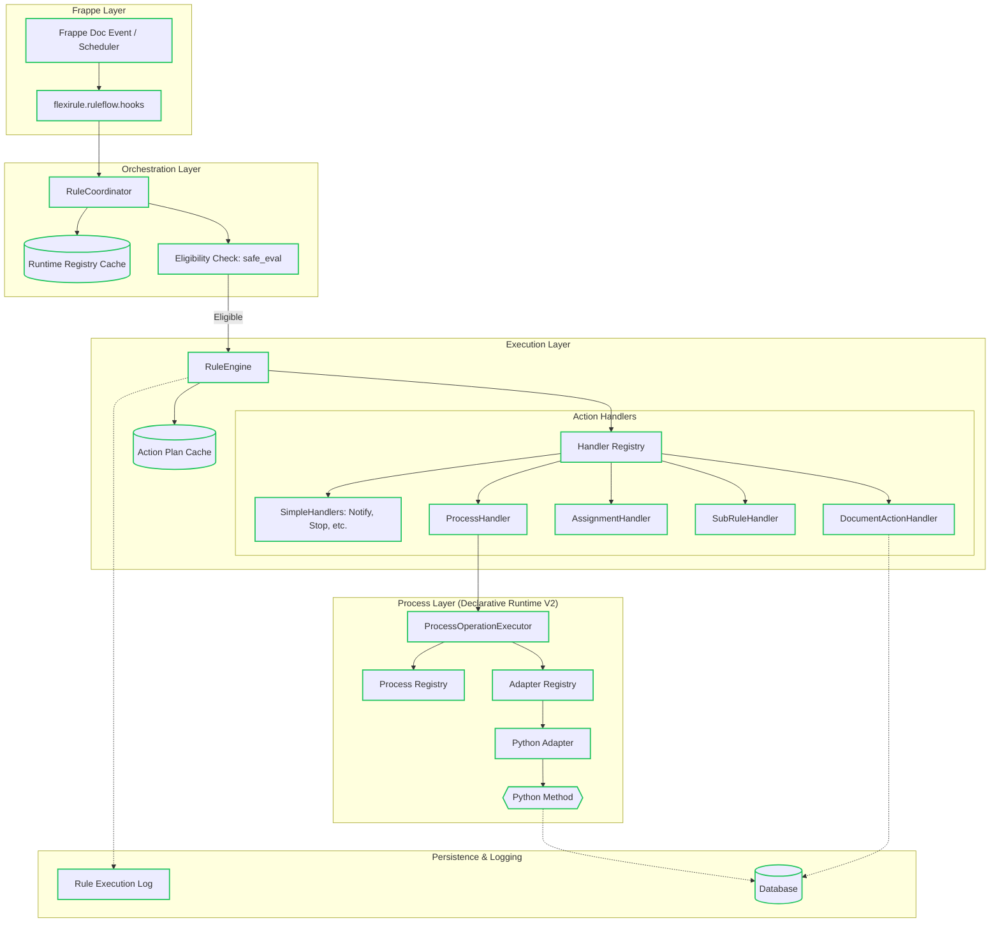

# Runtime Architecture Overview

This document provides a top-level overview of the FlexiRule execution stack, highlighting the primary runtime paths and architectural boundaries.

## Complete Execution Stack

## Runtime Path Verification

### 1. Verified Runtime Paths (Green)
*   **Hook Entry**: `hooks.py` → `coordinator.py`.
*   **Engine Flow**: `coordinator.py` → `engine.py` → `action_handlers/`.
*   **Process Execution**: `ProcessHandler` → `ProcessOperationExecutor` → `Python Adapter`.
*   **Caching**: Redis and `frappe.local` layers for Registry and Action Plans.
*   **Logging**: Asynchronous enqueuing of `Rule Execution Log`.

### 2. Optional / Conditional Paths
*   **Async Execution**: Rules or Actions marked as `Asynchronous` are enqueued via `frappe.enqueue`.
*   **Sub-rules**: Triggered only when a `Sub-Rule` action is present in the flow.
*   **Error Rollback**: Triggered only if `on_error: Rollback` is configured and an action fails.

### 3. Partially Implemented Paths
*   **Switch Action**: Registered in the frontend contract but marked as disabled; handler exists but has minimal usage in production rules.

### 4. Unverified / Unused Paths
*   **Data Review System**: `Data Review Task` exists but is not currently reachable from the standard rule execution flow.

## Architectural Boundaries

1.  **Safety Boundary**: `SafeFrappeAPI` and `safe_eval` protect the system from arbitrary code execution during condition evaluation.
2.  **Performance Boundary**: The `Runtime Registry` ensures that the overhead of checking for rules on every document save is minimal.
3.  **Extensibility Boundary**: The `Process` system allows third-party apps to add business logic without modifying the core engine, using a strict JSON-schema-based contract.
