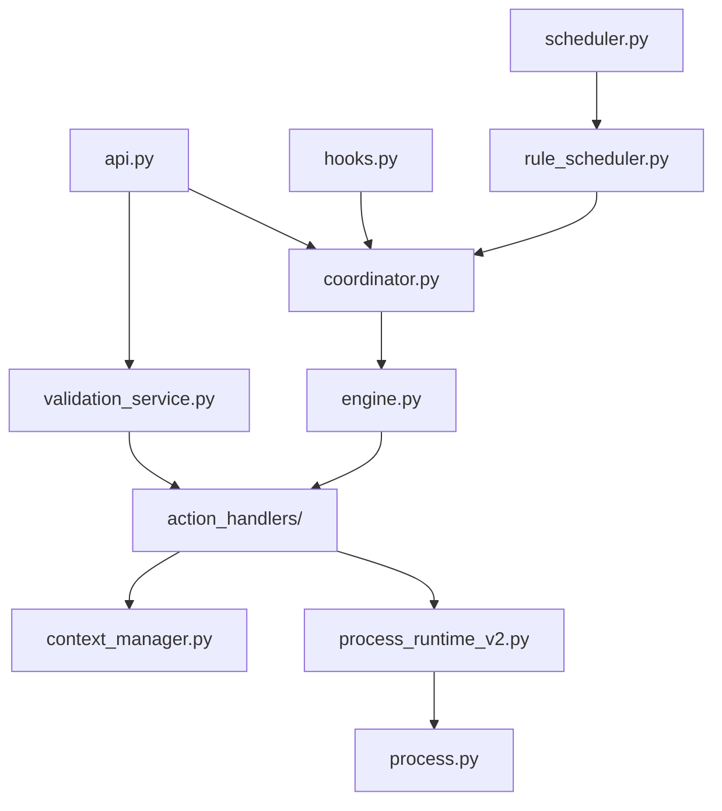

# Architecture Analysis

This document provides a deep-dive into the FlexiRule architectural components, their relationships, and an audit of the current implementation.

## Core Components

### 1. Rule Engine (`RuleEngine`)
- **Responsibility**: Orchestrates the execution of a single rule graph.
- **Key Methods**: `execute()`, `_execute_graph()`.
- **Sandbox**: Implements `SafeFrappeAPI` and `ReadOnlyDocument` to ensure safety during condition evaluation.

### 2. Execution Coordinator (`RuleCoordinator`)
- **Responsibility**: Discovery and dispatch. Maps DocType events to active rules.
- **Registry**: Manages the `flexirule_runtime_registry_v2` in Redis for high-performance rule lookup.

### 3. Process Engine (`ProcessOperationExecutor`)
- **Responsibility**: Executes "Process" actions using the Declarative Contract v2.
- **Source**: `flexirule/ruleflow/core/process_runtime_v2.py`.

### 4. Trigger Framework
- **Responsibility**: Decouples document events from the engine.
- **Contract**: `TRIGGER_TYPE_CONTRACT` defines required fields for different trigger types.

### 5. Registry System
- **HandlerRegistry**: Strategy pattern for Action Types (Assignment, Loop, etc.).
- **OperationAdapterRegistry**: Discovery and execution of Process Adapters.
- **AssignmentOperatorRegistry**: Custom operators for field assignments (set, add, clear).

### 6. Validation Framework
- **Central Service**: `validation_service.py` provides multi-mode validation (Full, Draft, Node).
- **Graph Validator**: `graph_validator.py` ensures graph integrity (connectivity, cycles).

---

## Dependency Map

---

## Architectural Audit Findings

### 1. Validation Duplication
- **Severity**: Medium
- **Description**: Validation logic is spread between `Rule.validate()`, `validation_service.py`, and individual `ActionHandler.validate()` methods.
- **Why it matters**: Increases maintenance cost and the risk of inconsistent validation between the frontend builder and backend save.
- **Source Files**: `rule.py`, `validation_service.py`, `action_handlers/__init__.py`.
- **Evidence**: `Rule.validate_with_service` calls `validate_rule_definition`, but `Rule` also has its own `validate_assignment` and `validate_set_value_editable` methods which overlap with `validation_service.py`.

### 2. Tight Coupling to JSON Serialization
- **Severity**: Low
- **Description**: Many configurations are stored as JSON strings in the database and parsed multiple times during execution.
- **Why it matters**: Minor performance overhead and potential for parsing errors if data becomes malformed.
- **Source Files**: `rule.py`, `engine.py`.
- **Evidence**: `_parse_action_config` is used in both the DocType controller and the execution engine, frequently parsing the same strings.

### 3. Circular Dependency Potential
- **Severity**: Medium
- **Description**: The relationship between Rule documents and the Validation Service creates a potential for circular imports if not carefully managed.
- **Why it matters**: Can lead to fragile code and startup errors in the Frappe environment.
- **Source Files**: `rule.py`, `validation_service.py`.
- **Evidence**: `Rule.py` imports `validate_rule_definition`, which in turn operates on `Rule` document instances and utilizes `HandlerRegistry`.

### 4. Runtime Discovery Bottlenecks
- **Severity**: Low
- **Description**: While Redis caching is implemented, the initial rebuild of the registry for a DocType with many rules could be optimized.
- **Why it matters**: Potential latency spike on first save after a cache clear.
- **Source Files**: `coordinator.py`.
- **Evidence**: `RuleCoordinator._build_runtime_registry` performs a full scan of active rules.

---

## Extension Guide

### How to add a new Action Type
1. Create a new handler in `flexirule/ruleflow/core/action_handlers/`.
2. Inherit from `ActionHandler`.
3. Implement `execute(self, action, context, engine)`.
4. Register the handler in `HandlerRegistry`.
5. Update `ACTION_TYPE_CONTRACT` in `contracts.py` to define its UI and validation behavior.

### How to add a new Process Operation
1. Create/Edit a `Process` document in the Desk.
2. Add a row to the `operations` child table.
3. Define the `config_schema` and `output_schema`.
4. If using `contract_v2`, define the `adapter_key` (e.g., `validate`, `transform`).
5. Implement the corresponding Python function in the process module (e.g., `{app}/{module}/process/{process_name}/{process_name}.py`).
