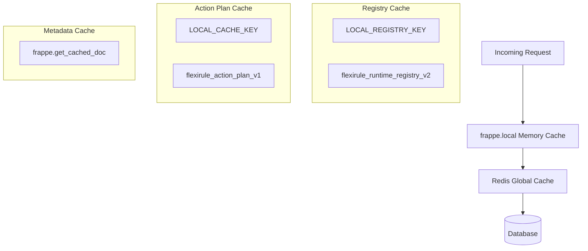
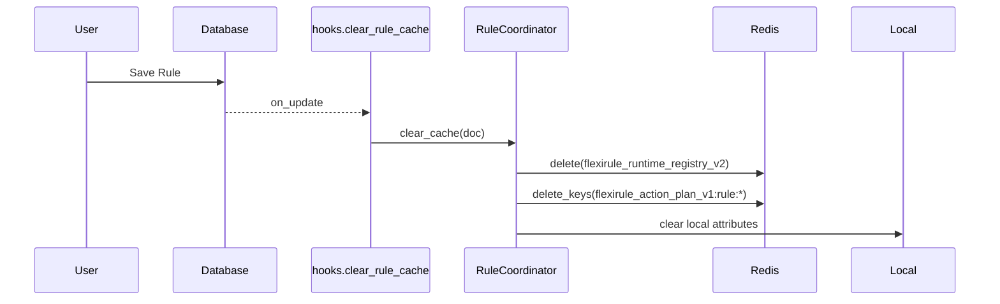

# Cache Architecture

FlexiRule employs a multi-layered caching strategy to ensure low-latency rule execution and minimize database overhead. The system uses a combination of request-local memory, Redis-backed global cache, and Frappe's built-in document caching.

## Cache Layers Overview

## 1. Runtime Registry Cache
**Purpose:** Stores a compiled map of active rules indexed by DocType and Event. This allows the `RuleCoordinator` to determine if any rules apply to a document event in $O(1)$ time without database queries.
**Status:** **Fully Implemented and Actively Used**

*   **Cache Key (Redis):** `flexirule_runtime_registry_v2`
*   **Payload:** `{ "cache_version": 2, "rules": { name: spec }, "doctype_event_map": { doctype: { event: [names] } } }`
*   **Invalidation:** Triggered by `RuleCoordinator.clear_cache()` when a `Rule` is inserted, updated, or deleted (via `hooks.clear_rule_cache`).
*   **Failure Behavior:** If Redis is down, it falls back to a DB rebuild every request.

---

## 2. Action Plan Cache
**Purpose:** Stores pre-compiled execution plans for Rule Actions (e.g., Assignment, Notify). Compiling Jinja templates or Python expressions once saves significant CPU time during high-frequency execution.
**Status:** **Fully Implemented and Actively Used**

*   **Cache Key (Redis):** `flexirule_action_plan_v1:{rule_name}:{rule_hash}`
*   **Payload:** `{ "cache_version": 3, "rule_name": str, "rule_hash": str, "actions": { action_id: compiled_spec } }`
*   **Invalidation:** Automatic via `rule_hash` (derived from rule content). Explicitly cleared via `clear_rule_action_plan_cache(rule_name)`.
*   **Logic:** Defined in `flexirule/ruleflow/core/action_plan_cache.py`.

---

## 3. Metadata & Document Cache
**Purpose:** Leverages Frappe's standard caching for frequently accessed DocTypes like `Rule`, `Process`, and `Module Def`.
**Status:** **Fully Implemented and Actively Used**

*   **Usage:** Extensive use of `frappe.get_cached_doc` in `RuleCoordinator`, `RuleEngine`, and `ProcessRegistry`.
*   **Benefit:** Avoids redundant `SELECT` queries for static configuration.

---

## 4. Local Memory Cache (`frappe.local`)
**Purpose:** Prevents redundant computation or Redis reads within a single web request.
**Status:** **Fully Implemented and Actively Used**

*   **Keys Used:**
    *   `flexirule_runtime_registry`: Local copy of the runtime registry.
    *   `flexirule_runtime_doctype_runtime`: Event specs for a specific DocType.
    *   `flexirule_action_plan_cache`: Local copy of action plans.
    *   `flexirule_runtime_changed_fields`: Diff of the current document for field-change filtering.

---

## Cache Lifecycle & Invalidation

## Runtime Usage Verification

| Cache Layer | Status | Verification |
| :--- | :--- | :--- |
| **Runtime Registry** | **Active** | Checked in every `execute_rules_from_event`. |
| **Action Plan Cache**| **Active** | Loaded in `RuleEngine` via `get_rule_action_plan`. |
| **frappe.local** | **Active** | Used in `coordinator.py` and `action_plan_cache.py`. |
| **Redis Cache** | **Active** | Backend for `frappe.cache`. |
| **Metadata Cache** | **Active** | Pervasive use of `frappe.get_cached_doc`. |

## Architectural Risks & Technical Debt
*   **Redis Dependency:** While the system falls back to DB on Redis failure, a Redis outage will significantly degrade performance due to constant registry/plan rebuilding.
*   **Stale Local Cache:** In long-running background workers (though rarely an issue in Frappe's request-response model), `frappe.local` might become stale if not cleared between jobs. `RuleCoordinator.clear_cache` handles this, but it must be called consistently.
*   **Cache Key Explosion:** `flexirule_action_plan_v1` keys include a hash. Over time, multiple versions of a rule can leave orphaned keys in Redis until they expire (default 24h).
