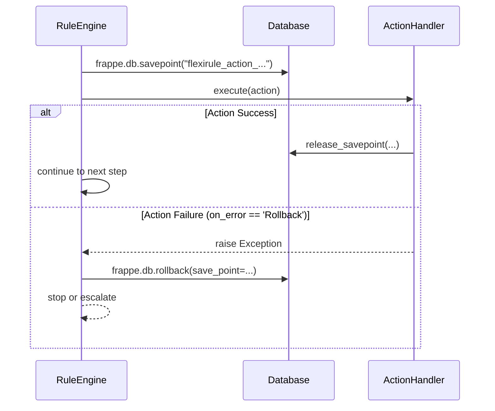

# Error Handling, Transactions & Rollback

FlexiRule provides a robust failure-path architecture to ensure that rule execution is predictable and does not leave the system in an inconsistent state.

## 1. Exception Propagation

The engine handles exceptions differently based on the trigger event and configuration.

### Blocking Exceptions
In standard Frappe lifecycle hooks (`Before Save`, `Validate`, `Before Submit`), any unhandled exception in the `RuleEngine` will propagate and stop the document operation. This prevents invalid data from being saved.

### Swallowed/Logged Exceptions
In "After" events (`After Save`, `On Submit`, `After Rename`), the `RuleCoordinator` catches exceptions to prevent breaking the finalization of the document transaction. These errors are logged to `Rule Execution Log` and Frappe's `Error Log`.

## 2. Transactions & Rollback

FlexiRule leverages Frappe's database transaction management but adds finer-grained control via **Savepoints**.

### Savepoints
The engine uses `frappe.db.savepoint()` before executing actions that might fail and require isolated rollback.
*   **Dry Run**: `RuleCoordinator.execute_rule` uses a savepoint to rollback the entire rule execution after it completes.
*   **Transactional Processes**: `ProcessOperationExecutor` (and legacy `_call_process_with_retry`) can wrap a specific process operation in a savepoint if its `transactional` flag is set.
*   **Action Rollback**: When a `Rule Action` is configured with `on_error: Rollback`, the engine rolls back to the savepoint created before that specific action.

## 3. Error Handling Policies (`on_error`)

Each `Rule Action` defines its own error handling policy:

| Policy | Behavior | Implementation |
| :--- | :--- | :--- |
| `Stop` | Halts execution and fails the rule. | Default behavior. |
| `Continue` | Logs warning and moves to `next_step_if_true`. | `RuleEngine._execute_graph`. |
| `Retry` | Retries the action with exponential backoff. | `time.sleep(2**attempt)` (Forbidden in Sync hooks). |
| `Rollback` | Reverts DB changes for this action and stops. | Uses `frappe.db.rollback(save_point=...)`. |
| `Escalate` | Re-raises the exception to the parent rule. | Used in Sub-Rule scenarios. |

## 4. Scheduler Failures

The `Rule Scheduler` executes documents in batches.
*   **Batch Isolation**: Each document execution is wrapped in a `try...except`.
*   **`on_error` (Batch)**:
    *   `Skip`: Logs error and continues to the next document in the batch.
    *   `Stop`: Halts the entire batch execution.
*   **Commits**: `frappe.db.commit()` is called every `batch_size` documents to persist progress.

## Runtime Usage Verification

| Component | Status | Verification |
| :--- | :--- | :--- |
| `frappe.db.savepoint` | **Active** | Used in `coordinator.py` (dry run) and `engine.py` (retry/rollback). |
| `on_error: Retry` | **Active** | Implemented with backoff in `RuleEngine._execute_graph`. |
| `on_error: Rollback`| **Active** | Uses savepoint rollback in `RuleEngine._execute_graph`. |
| `Scheduler Error` | **Active** | Handled in `RuleScheduler.execute`. |
| `Rule Execution Log` | **Active** | Captures `error_trace` for all failed runs. |

## Architectural Risks & Technical Debt
*   **Savepoint Leaks**: If `release_savepoint` is not called due to a logic error (though managed by `try...finally` in most places), it can lead to DB performance issues.
*   **Sync Hook Retries**: The `RuleEngine` correctly prevents `Retry` (which includes `time.sleep`) inside synchronous hooks to avoid blocking the web server threads.
*   **Partial State**: Actions that perform external side-effects (e.g., sending an API request or email) cannot be rolled back by `frappe.db.rollback`. Developers must handle "compensating transactions" manually for these.
