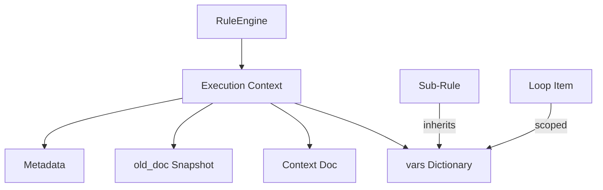

# Mutation & Context Propagation Model

FlexiRule uses a structured context model to manage state propagation and document mutations throughout a rule's execution.

## Execution Context Overview

The execution context is a dictionary passed between steps, containing both the subject document and any temporary state (`vars`).

## 1. Context Initialization

When a rule is triggered, the `RuleEngine` initializes the context:
*   **`doc`**: The current Frappe Document object.
*   **`old_doc`**: A snapshot of the document state before the current transaction (via `RuleCoordinator.get_doc_before_save`).
*   **`vars`**: An empty dictionary for runtime-only state.
*   **`meta`**: Includes `rule_name`, `user`, `execution_id`, and `test_mode`.

## 2. Variables Lifecycle (`vars`)

Variables in `vars` are transient and exist only for the duration of the rule execution.

*   **Setting Variables**: Action results are stored in `vars` using the `return_variable` name defined in the `Rule Action`.
*   **Scoping in Loops**: During a `Loop` action, the current item is typically stored as an alias in `vars` (e.g., `vars.item`).
*   **Sub-Rule Inheritance**: Sub-rules inherit the parent's `vars` by default, allowing for complex orchestration where state is passed down a hierarchy.

## 3. Mutation Model

The `ContextManager` (in `flexirule/ruleflow/core/context_manager.py`) provides structured methods to mutate the state based on the `mutation_mode` configured for an action.

| Mutation Mode | Target | Implementation |
| :--- | :--- | :--- |
| `Set Doc Field` | `doc` | `doc.set(target, value)` |
| `Update Doc Field`| `doc` | `for k, v in value.items(): doc.set(k, v)` |
| `Set Context Variable` | `vars` | `vars[target] = value` |
| `Update Context Variable` | `vars` | `vars[target].update(value)` (if dict) |
| `Append to Context Variable` | `vars` | `vars[target].append(value)` (if list) |
| `Batch Database Set` | Database | `frappe.db.set_value(...)` (Bypasses hooks) |

**Verification:** These paths are actively used in `RuleEngine._post_process_action_result`.

## 4. Handler Results Propagation

Every `ActionHandler` returns a result. The `RuleEngine` post-processes this result:
1.  **Input Mapping**: Transforms `vars` or `doc` fields into the required config for the next action.
2.  **Execution**: Runs the action.
3.  **Output Mapping**: Maps specific keys from the result back into `vars`.
4.  **Mutation**: Applies the chosen `mutation_mode`.

## 5. Sub-Rule & Recursion State

*   **Sub-rules**: Receive the full context of the parent.
*   **Re-entry Guard**: `RuleCoordinator` prevents infinite recursion of the same rule on the same document/event within a single request using `LOCAL_REENTRY_STACK_KEY`.

## Runtime Usage Verification

| Path | Status | Verification |
| :--- | :--- | :--- |
| `Context Initialization` | **Active** | `RuleEngine._initialize_context`. |
| `vars` Propagation | **Active** | Pervasive through all handlers. |
| `doc` Mutation | **Active** | Used in `Assignment`, `Document Action`, and `Process` handlers. |
| `old_doc` Access | **Active** | Available in `eval_globals` for all conditions and expressions. |
| `Batch Database Set`| **Active** | Implemented in `ContextManager.apply_mutation`. |

## Architectural Risks & Technical Debt
*   **Mutation without Save**: `Set Doc Field` mutates the in-memory `doc` object. If the rule is triggered in a `before_save` hook, Frappe will persist these changes. If triggered elsewhere, an explicit `doc.save()` (via `Document Action`) might be required, which could cause confusion.
*   **Variable Shadowing**: If a sub-rule or loop uses the same variable name as the parent without care, it can overwrite state.
*   **Non-Serializable Vars**: While the engine allows storing complex objects in `vars` during execution, only serializable types (JSON-compatible) are persisted in the `Rule Execution Log` context snapshot.
