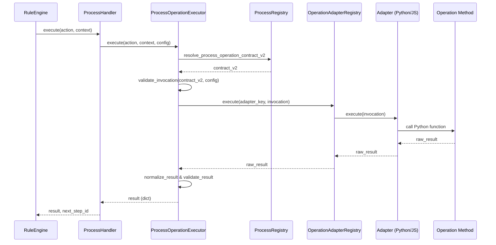

# Process Architecture & Extensibility

FlexiRule's Process Architecture provides a powerful extensibility mechanism allowing developers to define reusable, schema-driven operations in Python and JavaScript.

## Process Execution Flow

The following trace shows how a Process Action is executed at runtime.

## Discovery & Registration

### Backend (Python)
Processes are discovered during the `after_migrate` hook via `sync_all_processes` in `flexirule/ruleflow/core/process_sync.py`.

1.  **Scanning**: The system scans all installed apps for `{app}/{module}/process/{name}/{name}.json`.
2.  **Syncing**: For each JSON file, it creates or updates a `Process` DocType record.
3.  **Operation Mapping**: Operations defined in JSON are synced to the `Process Operation` child table.
4.  **Contract Verification**: `_normalize_operation_contract_v2` ensures that each operation defines a valid `contract_v2` with a supported `adapter_key`.

### Frontend (JavaScript)
The frontend discovers processes and operations via the `flexirule.ruleflow.api.get_contract_dto` API.

1.  **Loading**: `loadContractsFromBackend` in `flexirule/public/js/flexirule/core/contracts.js` fetches the `PROCESS_REGISTRY` and `PROCESS_OPERATION_REGISTRY_V2`.
2.  **Script Injection**: When a Process is selected in the Rule Builder, `loadProcessScript` is called to dynamically load the corresponding JavaScript adapter from `flexirule.ruleflow.doctype.process.process.get_process_script`.

## Operation Contracts (V2)

The system uses a "Declarative Contract V2" to ensure strict typing and security.

*   **Definition**: Stored in the `action_overrides` field of `Process Operation` as JSON.
*   **Key Components**:
    *   `adapter_key`: One of `validate`, `transform`, `lookup`, `dedupe`, `batch`.
    *   `config_schema`: JSON Schema for input validation.
    *   `result_schema`: JSON Schema for output validation.
    *   `capabilities`: Flags like `requires_doc`, `writes_to`, `allows_async`.
    *   `policy`: Governance rules like `allowed_mutations` and `allowed_return_types`.

## Adapter Layer

### Python Adapters
Python operations are executed via the `_execute_python_process_operation` in `flexirule/ruleflow/core/process_runtime_v2.py`.
*   **Resolution**: Resolves a dotted path `{app}.{module}.process.{process_name}.{func_name}`.
*   **Execution**: Invokes the function with `(context, config)`.

### JavaScript Adapters
JavaScript adapters are primarily used for UI behavior in the Rule Builder (field dependencies, custom validation).
*   **Implementation**: Defined in `process_name.js` within the process folder.
*   **Discovery**: Loaded into `window.flexirule.processes` on the client side.

## Extensibility Workflow for Developers

1.  **Create Folder**: `myapp/myapp/process/my_process/`.
2.  **Define JSON**: Create `my_process.json` defining operations and contracts.
3.  **Implement Python**: Create `my_process.py` with functions matching `func_name`.
4.  **Implement JS (Optional)**: Create `my_process.js` for custom Rule Builder behavior.
5.  **Sync**: Run `bench migrate` to register the Process.

## Runtime Usage Verification

| Component | Status | Verification |
| :--- | :--- | :--- |
| `ProcessHandler` | **Active** | Primary handler for Process actions in `RuleEngine`. |
| `ProcessOperationExecutor` | **Active** | Central logic for contract enforcement. |
| `OperationAdapterRegistry` | **Active** | Routes execution to Python methods. |
| `process_sync.py` | **Active** | Triggered during `after_migrate`. |
| `contracts.js` | **Active** | Powers the Rule Builder UI and schema resolution. |
| **JS Adapters** | **Active** | Loaded dynamically in `ProcessRuntime.js`. |

## Architectural Risks & Technical Debt
*   **Dynamic `frappe.get_attr`**: Python execution relies on string-based attribute lookup, which is flexible but lacks static analysis.
*   **Dual Schema**: The system sometimes falls back between backend `ui_schema` and frontend JS `get_config_fields`, which can lead to inconsistencies if not managed carefully.
*   **Adapter Limitation**: Currently, all supported `adapter_key` values in `process_runtime_v2.py` map to the same Python executor (`_execute_python_process_operation`). The distinction is primarily for future-proofing and UI categorization.
