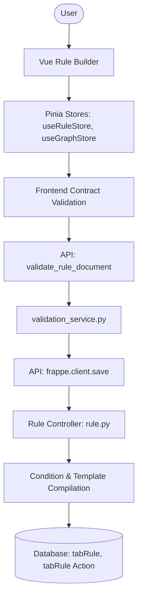

# Rule Creation & Save Lifecycle

This document traces the complete lifecycle of creating and saving a Rule in FlexiRule, from the frontend builder to database persistence.

## High-Level Flow

---

## 1. Rule Builder Initialization

When a user opens the Rule Builder, the system hydrates the UI with metadata and the current rule state.

### Components Involved
- **Frontend Entry**: `frappe.ui.RuleBuilder` class in `rule_builder.js`.
- **Vue App**: `App.vue` mounts the builder.
- **Pinia Stores**:
    - `useRuleStore`: Manages the Rule document lifecycle.
    - `useGraphStore`: Manages the Vue Flow nodes and edges.
    - `useMetaStore`: Manages DocType and Process metadata.

### Registry & Factory Loading
The builder fetches the "Source of Truth" for the architecture via the `get_contract_dto` API.
- **Source**: `flexirule.ruleflow.api.get_contract_dto`
- **Data Structures**:
    - `ACTION_TYPE_CONTRACT`: Defines behavior for Entry, Condition, Process, etc.
    - `TRIGGER_TYPE_CONTRACT`: Defines required fields for DocType vs. Scheduler events.
    - `process_registry`: Discovered via `flexirule.ruleflow.core.process_registry.get_process_registry`.

---

## 2. Rule Editing

The builder allows editing various components of a rule.

- **Conditions**: Managed by `ConditionStep.vue` and `ConditionBuilder`. Stored as JSON in `config` or `condition_json`.
- **Actions**: Represented as nodes in the graph. Each action type (Process, Assignment, etc.) has its own config component.
- **Triggers**: Configured in the `Entry Action` (Start) node.
- **Adapters**: For `Process` actions, the builder fetches available operations and their contracts (input/output schemas).

---

## 3. Save Flow

### Frontend Processing
**Source File**: `flexirule/public/js/flexirule/rule_builder/stores/useRuleStore.js`
**Method**: `save_changes()`

1.  **Contract Validation**: Iterates through all nodes and validates them against `validateAgainstContract` in `contracts.js`.
2.  **Topological Sort**: Uses `graphStore.getTopologicalSort()` to determine the execution order (saved as `idx` in child table).
3.  **Serialization**:
    - The visual layout is serialized into `visual_data`.
    - Nodes are transformed into `Rule Action` child table rows.
4.  **API Pre-check**: Calls `flexirule.ruleflow.api.validate_rule_document` with `mode="draft"`.

### Backend Controller Flow
**Source File**: `flexirule/ruleflow/doctype/rule/rule.py`
**Method**: `validate()`

1.  **Action Reordering**: `reorder_actions()` ensures the `Entry Action` is always `idx=1`.
2.  **Compilation Pipeline**:
    - `compile_conditions()`: Uses `ConditionCompiler` to transform JSON condition trees into safe Python expressions.
    - `compile_action_templates()`: Compiles UI segments (text, variables, conditionals) into Jinja templates.
    - `compile_action_mappings()`: Compiles resource mapper UI into backend mapping keys.
3.  **Validation Service**: `validate_with_service()` calls the centralized `validation_service.py`.
4.  **Cycle Detection**: `validate_no_sub_rule_cycles()` performs an in-memory DFS check to prevent infinite recursion in sub-rules.
5.  **Governance**: `validate_active_rule_lock()` prevents saving changes to an "Active" rule.

---

## 4. Validation Pipeline

The system uses a multi-stage validation pipeline:

| Stage | Logic Provider | Scope |
| :--- | :--- | :--- |
| **Frontend** | `contracts.js` | Mandatory fields, basic type checks. |
| **Pre-Save API** | `validation_service.py` | Schema validation, connectivity, reachability. |
| **Backend (Controller)** | `rule.py` | Compilation errors, cycle detection, active locks. |
| **Trigger Alignment** | `rule.py` | Ensures write actions (Assignment) aren't in "After Save" events. |

---

## 5. Persistence Model

- **Main DocType**: `Rule`
    - `visual_data`: Stores the Vue Flow JSON (nodes, positions, edges).
    - `compiled_expression`: The Python expression for the trigger condition.
- **Child Table**: `Rule Action`
    - `action_id`: Unique identifier for graph linking.
    - `config`: JSON blob containing action-specific settings.
    - `next_step_if_true` / `next_step_if_false`: Pointers to other `action_id`s.
    - `idx`: Execution sequence derived from topological sort.

---

## 6. Rule Activation & Cache Lifecycle

Rule activation is managed through the lifecycle transition API.

- **Source**: `flexirule.ruleflow.api.transition_rule`
- **Behavior**:
    - Sets `status` to "Active" and `is_active` to 1.
    - Triggers `Rule.validate()` in `full` mode.
- **Cache Invalidation**:
    - `RuleCoordinator.clear_cache()` is called in `Rule.on_update` via `hooks.py`.
    - This invalidates the Redis-backed `flexirule_runtime_registry_v2`.
    - Future document events will trigger a registry rebuild on the next execution.

---

## Source Trace: Rule Creation & Save

**File** → **Class** → **Method** → **Next Call**

1. `flexirule/public/js/flexirule/rule_builder/stores/useRuleStore.js` → `N/A` → `save_changes` → `flexirule.ruleflow.api.validate_rule_document` (API Call)
2. `flexirule/ruleflow/api.py` → `N/A` → `validate_rule_document` → `flexirule.ruleflow.core.validation_service.validate_rule_definition`
3. `flexirule/ruleflow/core/validation_service.py` → `N/A` → `validate_rule_definition` → `Rule.compile_conditions` (via `frappe.get_doc`)
4. `flexirule/ruleflow/api.py` → `N/A` → `save_changes` (Success) → `frappe.client.save` (via `frappe.call`)
5. `frappe/model/document.py` → `Document` → `save` → `Rule.validate`
6. `flexirule/ruleflow/doctype/rule/rule.py` → `Rule` → `validate` → `reorder_actions`
7. `flexirule/ruleflow/doctype/rule/rule.py` → `Rule` → `validate` → `compile_conditions`
8. `flexirule/ruleflow/doctype/rule/rule.py` → `Rule` → `validate` → `compile_action_templates`
9. `flexirule/ruleflow/doctype/rule/rule.py` → `Rule` → `validate` → `compile_action_mappings`
10. `flexirule/ruleflow/doctype/rule/rule.py` → `Rule` → `validate` → `validate_with_service`
11. `flexirule/ruleflow/core/validation_service.py` → `N/A` → `validate_rule_definition` (Final validation)
12. `flexirule/ruleflow/doctype/rule/rule.py` → `Rule` → `validate` → `validate_no_sub_rule_cycles`
13. `frappe/model/document.py` → `Document` → `save` → `db_insert` / `db_update` (Persistence)
