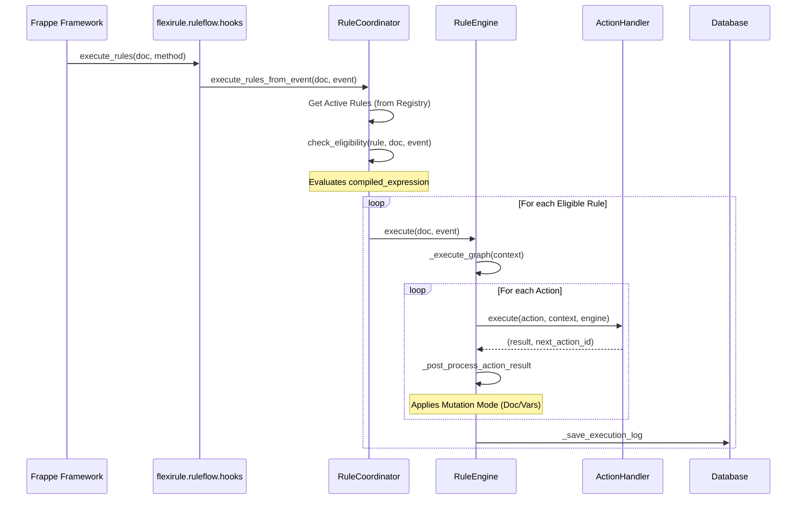
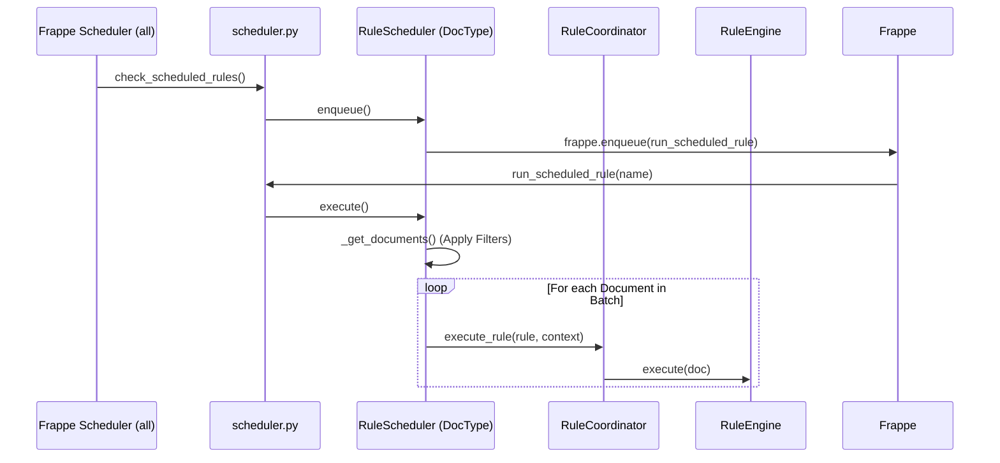

# Rule Execution Lifecycle

This document traces the runtime execution path of FlexiRule across different trigger types.

## A. Document Event Triggers

Document events are triggered by Frappe's standard document lifecycle hooks (e.g., Before Save, After Save).

### Sequence Diagram

### 1. Registration & Hook Discovery
- **Hook Definition**: `flexirule/hooks.py` registers `flexirule.ruleflow.hooks.execute_rules` for almost all DocType events (`*`).
- **Exclusion List**: `get_excluded_doctypes()` in `hooks.py` prevents execution on system DocTypes (Email Queue, Version, etc.) and internal FlexiRule DocTypes to avoid recursion.

### 2. Rule Lookup & Filtering
- **Runtime Registry**: `RuleCoordinator.get_runtime_registry()` uses a Redis-backed index (`flexirule_runtime_registry_v2`) for O(1) lookup of active rules by `doctype` and `event`.
- **Field Filtering**: `_passes_watched_field_filter()` skips rules if `watched_fields` are defined and none of them changed in the current transaction.
- **Eligibility**: `check_eligibility()` evaluates the `compiled_expression` (trigger condition) using `frappe.safe_eval`.

### 3. Execution Context
- **Context Creation**: `RuleEngine._initialize_context()` creates a sandbox containing:
    - `doc`: The current document.
    - `old_doc`: State before save (if available).
    - `vars`: Execution-local variables.
    - `frappe`: `SafeFrappeAPI` (restricted read-only access).
    - `rule`: Metadata about the running rule.

### 4. Action Execution
- **Strategy Pattern**: The `RuleEngine` dispatches actions to `HandlerRegistry`.
- **Handlers**: Each action type (Assignment, Process, Condition) has a dedicated handler in `flexirule/ruleflow/core/action_handlers/`.
- **Mutation Handling**: `RuleEngine._post_process_action_result` applies "Mutation Modes":
    - **Set Doc Field**: Directly modifies `doc.fieldname`.
    - **Set Context Variable**: Stores result in `vars`.

---

## B. Scheduled Event Triggers

Scheduled rules run on document batches at specific intervals.

### Sequence Diagram

### 1. Scheduler Registration
- **Frappe Hook**: `scheduler_events['all']` calls `check_scheduled_rules` every minute.
- **Due Check**: `RuleScheduler.is_event_due()` uses `croniter` to determine if the next execution time has passed.

### 2. Execution Flow
- **Background Queue**: Jobs are enqueued via `frappe.enqueue` with a unique `job_id` (`rule_scheduler::{name}`) to prevent overlapping runs of the same scheduler.
- **Batching**: `RuleScheduler.execute()` fetches document names using `filter_json` and processes them in batches (default 100), committing the transaction between batches.

---

## C. Callable Event Triggers

Callable rules are executed on-demand, either as subrules or via API.

### Mode 1: Subrule Execution
**Rule A → Action: Sub-Rule → Rule B**

- **Discovery**: `SubRuleHandler` fetches Rule B by name.
- **Context Inheritance**: Rule B receives the same `doc` and `vars` from Rule A.
- **Recursion Protection**: `validate_no_sub_rule_cycles()` (at save time) and `MAX_SUB_RULE_DEPTH = 2` (at runtime) prevent infinite loops.

### Mode 2: API/User Execution
**frappe.call() → api.py → Rule Engine**

- **Endpoints**: `flexirule.ruleflow.api.execute_rule` or `test_rule`.
- **Permission Check**: `_require_api_access()` ensures only users with "Rule Builder" or "System Manager" roles can trigger rules manually.
- **Response**: Returns a structured payload including `path_trace` and final `vars` for UI rendering.

---

## Source Trace Summary

### Document Event Flow
**File** → **Class** → **Method** → **Next Call**

1. `frappe/model/document.py` → `Document` → `run_hooks` → `flexirule.ruleflow.hooks.execute_rules`
2. `flexirule/ruleflow/hooks.py` → `N/A` → `execute_rules` → `RuleCoordinator.execute_rules_from_event`
3. `flexirule/ruleflow/core/coordinator.py` → `RuleCoordinator` → `execute_rules_from_event` → `RuleEngine.execute`
4. `flexirule/ruleflow/core/engine.py` → `RuleEngine` → `execute` → `_execute_graph`
5. `flexirule/ruleflow/core/engine.py` → `RuleEngine` → `_execute_graph` → `HandlerRegistry.get`
6. `flexirule/ruleflow/core/action_handlers/process.py` → `ProcessHandler` → `execute` → `ProcessOperationExecutor.execute`
7. `flexirule/ruleflow/core/process_runtime_v2.py` → `ProcessOperationExecutor` → `execute` → `OperationAdapterRegistry.execute`
8. `flexirule/ruleflow/core/process_runtime_v2.py` → `OperationAdapterRegistry` → `execute` → `_execute_python_process_operation`
9. `flexirule/ruleflow/core/process_runtime_v2.py` → `N/A` → `_execute_python_process_operation` → `Process.execute` (via module lookup)

### Scheduled Event Flow
**File** → **Class** → **Method** → **Next Call**

1. `flexirule/ruleflow/scheduler.py` → `N/A` → `check_scheduled_rules` → `RuleScheduler.enqueue`
2. `flexirule/ruleflow/doctype/rule_scheduler/rule_scheduler.py` → `RuleScheduler` → `enqueue` → `frappe.enqueue`
3. `flexirule/ruleflow/scheduler.py` → `N/A` → `run_scheduled_rule` → `RuleScheduler.execute`
4. `flexirule/ruleflow/doctype/rule_scheduler/rule_scheduler.py` → `RuleScheduler` → `execute` → `RuleCoordinator.execute_rule`
5. `flexirule/ruleflow/core/coordinator.py` → `RuleCoordinator` → `execute_rule` → `RuleEngine.execute`

### Callable API Flow
**File** → **Class** → **Method** → **Next Call**

1. `flexirule/ruleflow/api.py` → `N/A` → `execute_rule` → `RuleCoordinator.execute_rule`
2. `flexirule/ruleflow/core/coordinator.py` → `RuleCoordinator` → `execute_rule` → `RuleEngine.execute`
