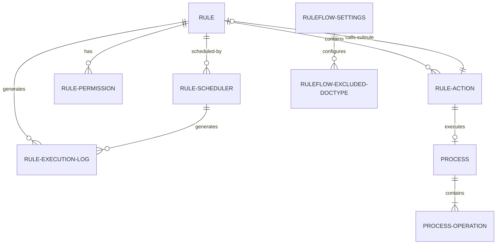
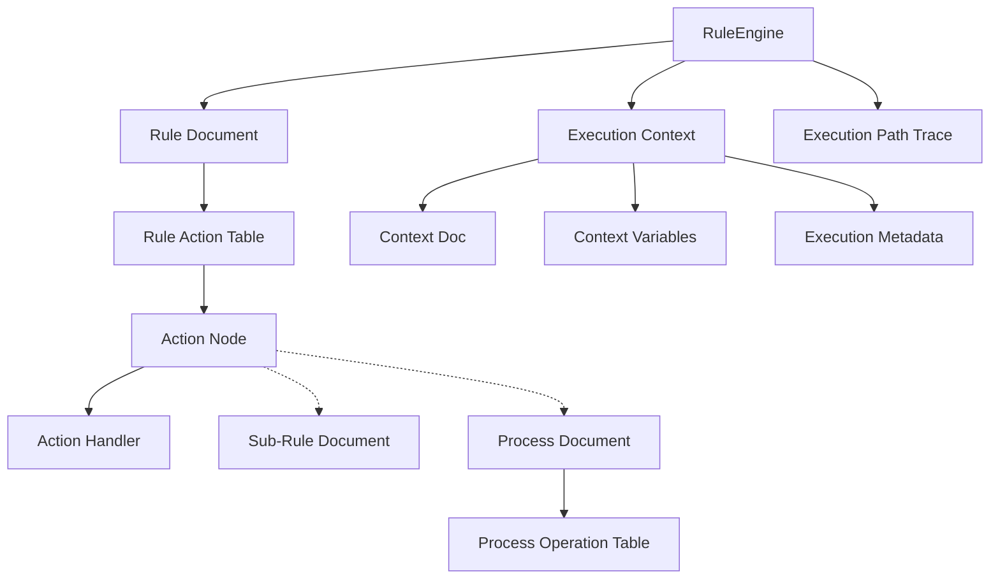

# Runtime Data Model

The FlexiRule Runtime Data Model is built around the Frappe Framework's DocType system, extending it to provide a flexible and high-performance rule execution environment.

## Entity Relationship Diagram (ERD)

## Runtime Object Graph

During execution, the `RuleEngine` works with an in-memory representation of these entities, optimized for performance via the `RuleCoordinator`'s runtime registry.

## Core Entities

### 1. Rule (`Rule`)
**Purpose:** Defines the entry point and configuration for a business rule or orchestration flow.
**Status:** **Fully Implemented and Actively Used**

| Key Field | Type | Purpose | Runtime Usage |
| :--- | :--- | :--- | :--- |
| `rule_name` | Data | Unique identifier | Used as primary key and in logs. |
| `document_type` | Link | Target DocType | Filtered by `RuleCoordinator` to find relevant rules. |
| `trigger_event`| Select | Hook event | Used by `RuleCoordinator` for dispatching. |
| `is_active` | Check | Activation flag | Read by `RuleCoordinator` to build the runtime registry. |
| `trigger_condition` | Code (JSON) | User-defined logic | **Compiled** into `compiled_expression`. |
| `compiled_expression` | Code (Python) | Optimized filter | Evaluated by `RuleCoordinator` before rule execution. |
| `priority` | Select | Execution order | Determines order in `RuleCoordinator.get_applicable_rules`. |
| `execution_mode` | Select | Sync/Async | Used by `RuleCoordinator` to decide whether to `frappe.enqueue`. |
| `actions` | Table | Flow definition | Loaded by `RuleEngine` to build the execution graph. |

**Evidence:** Referenced in `flexirule/ruleflow/core/coordinator.py` for registry building and `flexirule/ruleflow/core/engine.py` for initialization.

---

### 2. Rule Action (`Rule Action`)
**Purpose:** A child table within `Rule` that defines an individual step in the execution flow.
**Status:** **Fully Implemented and Actively Used**

| Key Field | Type | Purpose | Runtime Usage |
| :--- | :--- | :--- | :--- |
| `action_id` | Data | Node identifier | Used for graph traversal (`next_step_if_true`). |
| `action_type` | Select | Handler type | Determines which `ActionHandler` is used. |
| `config` | Code (JSON) | Step configuration | Passed to the handler as execution parameters. |
| `next_step_if_true`| Data | Success path | Directs the `RuleEngine` to the next node. |
| `mutation_mode` | Select | State update | Applied by `RuleEngine` post-execution. |
| `return_variable` | Data | Result storage | Key used to store result in `context.vars`. |

**Evidence:** Iterated in `RuleEngine._execute_graph` in `flexirule/ruleflow/core/engine.py`.

---

### 3. Process (`Process`)
**Purpose:** Defines a reusable collection of operations (Python methods) that can be called from Rule Actions.
**Status:** **Fully Implemented and Actively Used**

**Evidence:** Loaded by `ProcessActionHandler` (via `ProcessRegistry` or `frappe.get_doc`).

---

### 4. Process Operation (`Process Operation`)
**Purpose:** A child table within `Process` defining an atomic task.
**Status:** **Fully Implemented and Actively Used**

**Evidence:** Method calls resolved in `flexirule/ruleflow/core/process_runtime_v2.py`.

---

### 5. Rule Execution Log (`Rule Execution Log`)
**Purpose:** Persists details of rule execution for auditing and debugging.
**Status:** **Fully Implemented and Actively Used**

| Key Field | Type | Purpose | Runtime Usage |
| :--- | :--- | :--- | :--- |
| `execution_id` | Data | Unique ID | Links logs across the system. |
| `status` | Select | Final state | Success, Failed, or Stopped. |
| `execution_path` | Code (JSON) | Trace of steps | Visualized in the UI. |
| `context_snapshot`| Code (JSON) | Variable state | Snapshot of `context.vars`. |

**Evidence:** Created and enqueued in `RuleEngine._save_execution_log`.

---

### 6. Rule Scheduler (`Rule Scheduler`)
**Purpose:** Triggers rules based on time or cron schedules instead of document events.
**Status:** **Fully Implemented and Actively Used**

**Evidence:** Referenced in `flexirule/ruleflow/scheduler.py` and enqueued via Frappe's `scheduler_events`.

---

### 7. Data Review Task (`Data Review Task`)
**Purpose:** Manages human-in-the-loop tasks (Duplicates, Data Quality).
**Status:** **Implemented but Currently Unused / Experimental**

*   **Verification:** This DocType exists and has a controller, but it is **not** referenced by any production execution paths in `core/` or `action_handlers/`. No `Process` or `ActionHandler` currently creates `Data Review Task` records automatically.
*   **Recommendation:** Mark as **Experimental/Unverified Runtime Usage**.

---

### 8. RuleFlow Settings & Excluded DocTypes
**Purpose:** Global configuration and performance tuning.
**Status:** **Fully Implemented and Actively Used**

**Evidence:** `flexirule/ruleflow/hooks.py` uses `RuleFlow Settings` to filter doctypes before rule evaluation.

---

## Field Classification

| Type | Examples | Description |
| :--- | :--- | :--- |
| **Persisted** | `rule_name`, `is_active`, `actions` | Stored in Database. |
| **Compiled** | `compiled_expression` | Derived from `trigger_condition` on save. |
| **Runtime-Only** | `context.vars`, `path_trace` | Exist only during `RuleEngine` execution. |
| **Virtual** | `Rule Scheduler.next_execution` | Computed on the fly for UI display. |

## Architectural Risks & Technical Debt
*   **Data Review Task** appears to be "dead code" or a future feature that is not yet wired into the engine.
*   **JSON Fields** (`config`, `context_snapshot`): Heavily used for flexibility, but can be difficult to query directly via SQL for reporting without specialized JSON functions.
*   **Rule Versioning**: Incremented on amendment, but `Rule Execution Log` links to the Rule by name, which might lead to confusion if historical rules are renamed (though `autoname` is set to `rule_name`).
