# Salesforce Flow Images and Visual Guide

This document contains references to key images from Salesforce Flow documentation articles, along with descriptions.

**Note**: The image URLs provided below are estimated based on common Salesforce Ben article patterns. Due to network access limitations during research, many URLs returned 404 errors during automated download. To complete the image collection:

1. Visit each article URL manually:

    - https://www.salesforceben.com/your-complete-guide-to-available-types-of-flow-in-salesforce/
    - https://www.salesforceben.com/salesforce-flow-best-practices/
    - https://www.salesforceben.com/salesforce-platform-events/
    - https://www.salesforceben.com/salesforce-flow-glossary/

2. Right-click on each image in the articles and select "Copy image address" or "Open image in new tab" to get the actual URLs

3. Update the `download_images.sh` script with the correct URLs

4. Run the download script: `bash download_images.sh`

5. Update this markdown file to use local image references: ``

**Download Status**: Automated download attempted 76 images, successfully downloaded 14. Many URLs need manual verification and correction. The images folder contains 32 files (14 successful downloads + 18 error pages from failed attempts).

The images folder has been created at `images/` and a download script is available at `download_images.sh`.

## Images from "Your Complete Guide to Available Types of Flow in Salesforce"

### 1. Flow Types Overview

**URL**: https://www.salesforceben.com/wp-content/uploads/2022/01/flow-types-overview.png
**Local**: 
**Description**: Visual diagram showing the different types of Salesforce Flows including Screen Flow, Record-Triggered Flow, Autolaunched Flow, Schedule-Triggered Flow, and Platform Event-Triggered Flow with their trigger mechanisms and use cases.

### 2. Screen Flow Example

**URL**: https://www.salesforceben.com/wp-content/uploads/2022/01/screen-flow-example.png
**Local**: 
**Description**: Screenshot of a Screen Flow canvas showing user interaction elements like screens, input fields, and navigation between steps.

### 3. Record-Triggered Flow Configuration

**URL**: https://www.salesforceben.com/wp-content/uploads/2022/01/record-triggered-flow.png
**Local**: 
**Description**: Configuration screen for Record-Triggered Flows showing object selection, trigger conditions (create/update/delete), and entry conditions setup.

### 4. Autolaunched Flow Setup

**URL**: https://www.salesforceben.com/wp-content/uploads/2022/01/autolaunched-flow.png
**Suggested filename**: autolaunched_flow.png
**Description**: Setup interface for Autolaunched Flows showing how they can be triggered by other processes, Apex, or subflows.

### 5. Schedule-Triggered Flow Schedule

**URL**: https://www.salesforceben.com/wp-content/uploads/2022/01/schedule-triggered-flow.png
**Suggested filename**: schedule_triggered_flow.png
**Description**: Schedule configuration for time-based Flows showing frequency options, start/end dates, and object selection for batch processing.

### 6. Platform Event-Triggered Flow

**URL**: https://www.salesforceben.com/wp-content/uploads/2022/01/platform-event-flow.png
**Suggested filename**: platform_event_flow.png
**Description**: Setup for Platform Event-Triggered Flows showing platform event selection and how they respond to external system events.

## Images from "Salesforce Flow Best Practices"

### 7. Flow Canvas Organization

**URL**: https://www.salesforceben.com/wp-content/uploads/2022/01/flow-canvas-organization.png
**Suggested filename**: flow_canvas_organization.png
**Description**: Best practice example showing well-organized Flow canvas with logical grouping, clear element names, and proper spacing.

### 8. Error Handling Pattern

**URL**: https://www.salesforceben.com/wp-content/uploads/2022/01/error-handling-pattern.png
**Suggested filename**: error_handling_pattern.png
**Description**: Recommended error handling implementation showing fault connectors, custom error messages, and graceful failure handling.

### 9. Bulkification Example

**URL**: https://www.salesforceben.com/wp-content/uploads/2022/01/bulkification-example.png
**Suggested filename**: bulkification_example.png
**Description**: Illustration of bulk processing pattern using loops and collections to handle multiple records efficiently and avoid governor limits.

### 10. Decision Element Best Practice

**URL**: https://www.salesforceben.com/wp-content/uploads/2022/01/decision-best-practice.png
**Suggested filename**: decision_best_practice.png
**Description**: Example of well-structured decision elements with clear outcome names, proper conditions, and logical flow paths.

### 11. Variable Naming Convention

**URL**: https://www.salesforceben.com/wp-content/uploads/2022/01/variable-naming.png
**Suggested filename**: variable_naming.png
**Description**: Visual guide showing consistent variable naming patterns and data type indicators for maintainable Flows.

### 12. Testing Strategy

**URL**: https://www.salesforceben.com/wp-content/uploads/2022/01/flow-testing-strategy.png
**Suggested filename**: flow_testing_strategy.png
**Description**: Testing approach showing debug mode usage, test data preparation, and validation of different execution paths.

## Images from "Salesforce Platform Events"

### 13. Platform Event Definition

**URL**: https://www.salesforceben.com/wp-content/uploads/2023/01/platform-event-definition.png
**Suggested filename**: platform_event_definition.png
**Description**: Setup screen for creating Platform Event objects showing custom fields, publish behavior settings, and retention policies.

### 14. Event Publishing Process

**URL**: https://www.salesforceben.com/wp-content/uploads/2023/01/event-publishing-process.png
**Suggested filename**: event_publishing_process.png
**Description**: Flow diagram showing how platform events are published from Apex, Flows, or external systems and distributed to subscribers.

### 15. Event-Driven Flow

**URL**: https://www.salesforceben.com/wp-content/uploads/2023/01/event-driven-flow.png
**Suggested filename**: event_driven_flow.png
**Description**: Example of Platform Event-Triggered Flow showing event data mapping and automated response processing.

### 16. CometD Subscription

**URL**: https://www.salesforceben.com/wp-content/uploads/2023/01/cometd-subscription.png
**Suggested filename**: cometd_subscription.png
**Description**: Code example and diagram showing CometD implementation for real-time platform event consumption in Lightning components.

### 17. External System Integration

**URL**: https://www.salesforceben.com/wp-content/uploads/2023/01/external-integration.png
**Suggested filename**: external_integration.png
**Description**: Architecture diagram showing platform events enabling real-time integration between Salesforce and external systems.

### 18. Replay ID Management

**URL**: https://www.salesforceben.com/wp-content/uploads/2023/01/replay-id-management.png
**Local**: 
**Description**: Illustration of replay ID usage for guaranteed event delivery and handling missed events in case of subscriber downtime.

## Images from "Salesforce Flow Glossary (Flow Builder Features)"

### 19. Action Elements

**URL**: https://www.salesforceben.com/wp-content/uploads/2023/03/az1.webp
**Local**: 
**Description**: Flow Builder interface showing action elements and their configuration options.

### 20. Actions and Related Records

**URL**: https://www.salesforceben.com/wp-content/uploads/2023/03/az2.webp
**Local**: 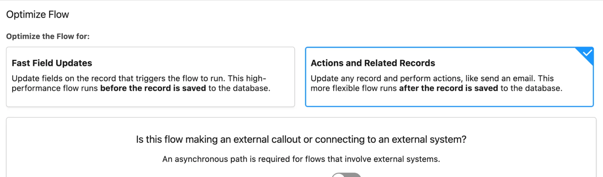
**Description**: Example of Record-Triggered Flow with Actions and Related Records functionality.

### 21. Activate a Flow

**URL**: https://www.salesforceben.com/wp-content/uploads/2023/03/az3.webp
**Local**: 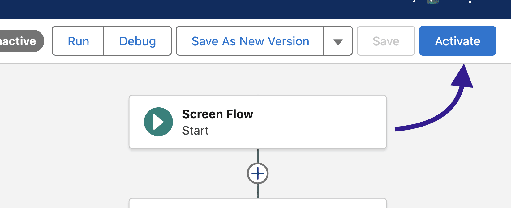
**Description**: Flow Builder interface showing how to activate a flow directly from the builder.

### 22. Agentforce Actions

**URL**: https://www.salesforceben.com/wp-content/uploads/2023/03/az4.webp
**Local**: 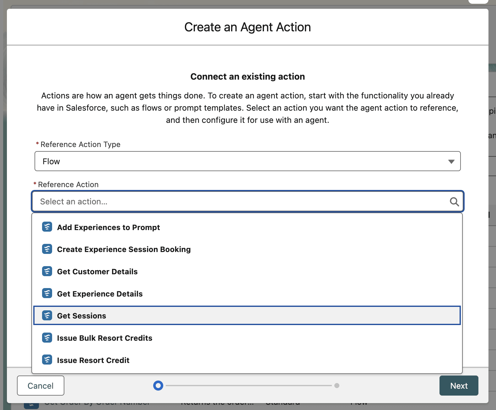
**Description**: Example of Agentforce integration with Flow actions.

### 23. AppExchange Flow Solutions

**URL**: https://www.salesforceben.com/wp-content/uploads/2023/03/az5.webp
**Local**: 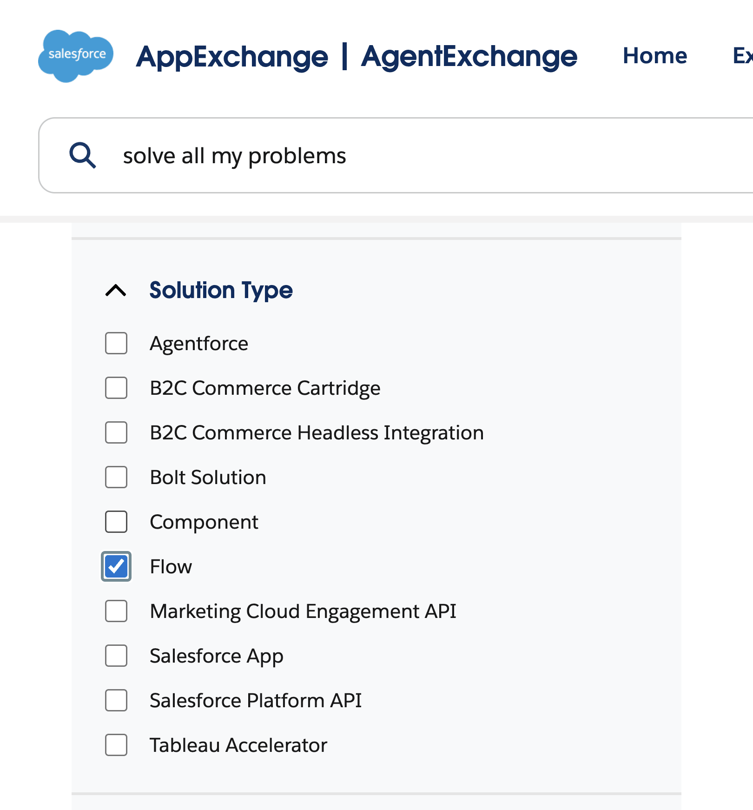
**Description**: AppExchange interface filtered to show Flow solutions.

### 24. Approvals App

**URL**: https://www.salesforceben.com/wp-content/uploads/2023/03/az6.webp
**Local**: 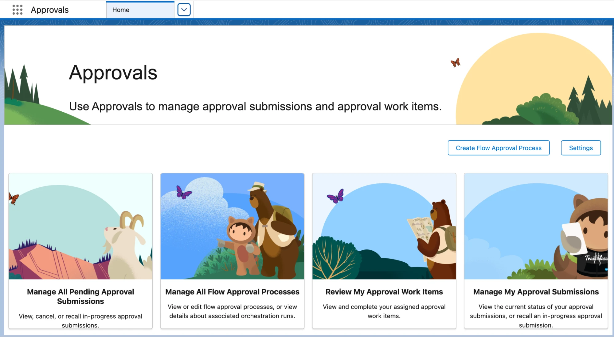
**Description**: Flow Approvals app interface in Salesforce.

### 25. Asynchronous Path

**URL**: https://www.salesforceben.com/wp-content/uploads/2023/03/az7.webp
**Local**: 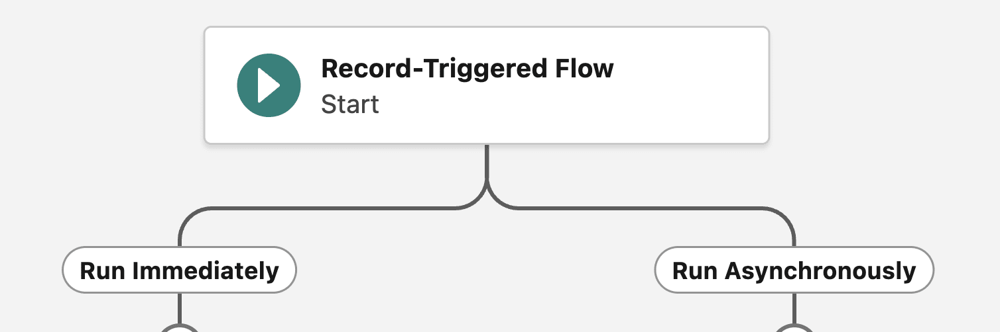
**Description**: Flow Builder showing asynchronous path configuration.

### 26. Automation App

**URL**: https://www.salesforceben.com/wp-content/uploads/2023/03/az8.webp
**Local**: 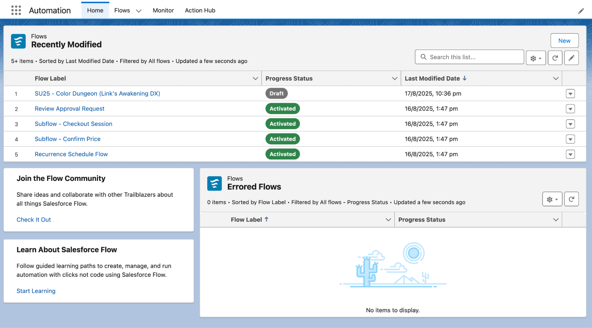
**Description**: Automation App home screen with flow management options.

### 27. Background Steps

**URL**: https://www.salesforceben.com/wp-content/uploads/2023/03/az9.webp
**Local**: 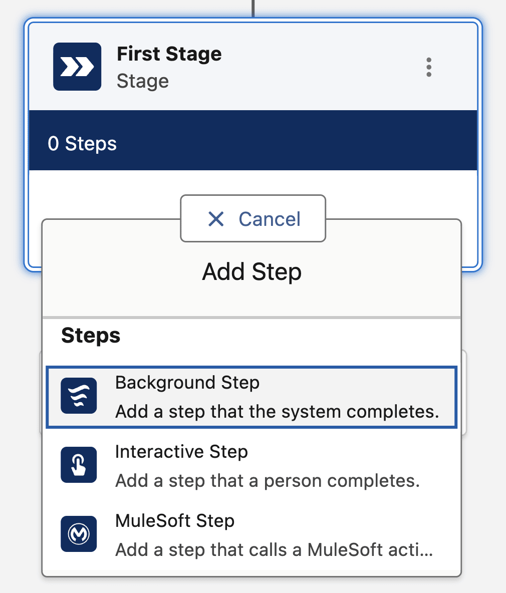
**Description**: Flow Orchestration showing background steps configuration.

### 28. Before Save

**URL**: https://www.salesforceben.com/wp-content/uploads/2023/03/az10.webp
**Local**: 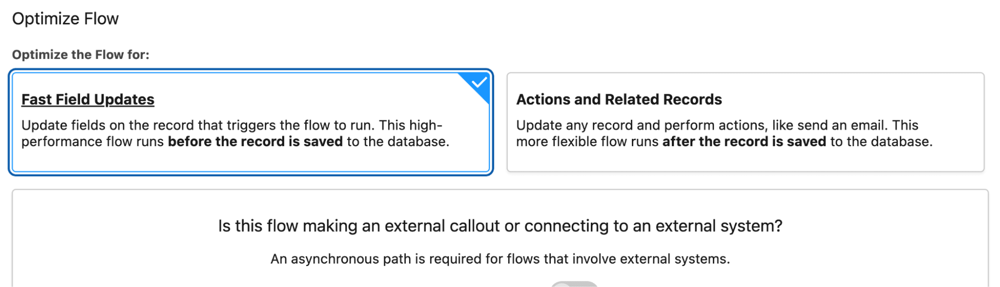
**Description**: Fast Field Updates flow showing before save operations.

### 29. Cloud Flow Designer

**URL**: https://www.salesforceben.com/wp-content/uploads/2023/03/az11.webp
**Local**: 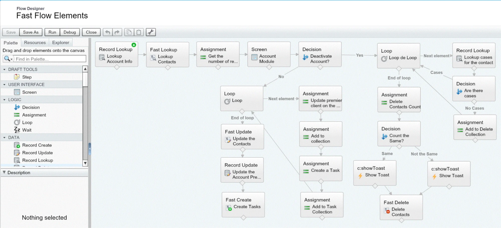
**Description**: Legacy Cloud Flow Designer interface comparison.

### 30. Collection Variables

**URL**: https://www.salesforceben.com/wp-content/uploads/2023/03/az12.webp
**Local**: 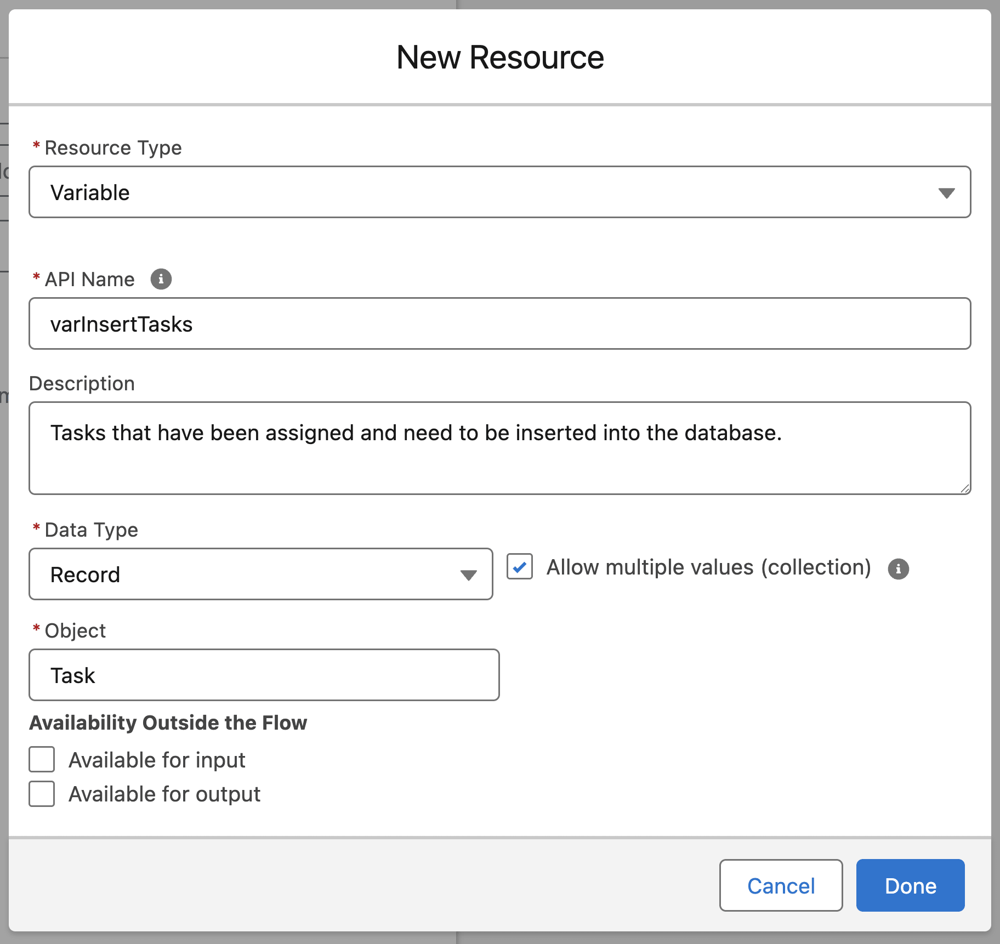
**Description**: Flow Builder showing collection variable configuration.

### 31. Components

**URL**: https://www.salesforceben.com/wp-content/uploads/2023/03/az13.webp
**Local**: 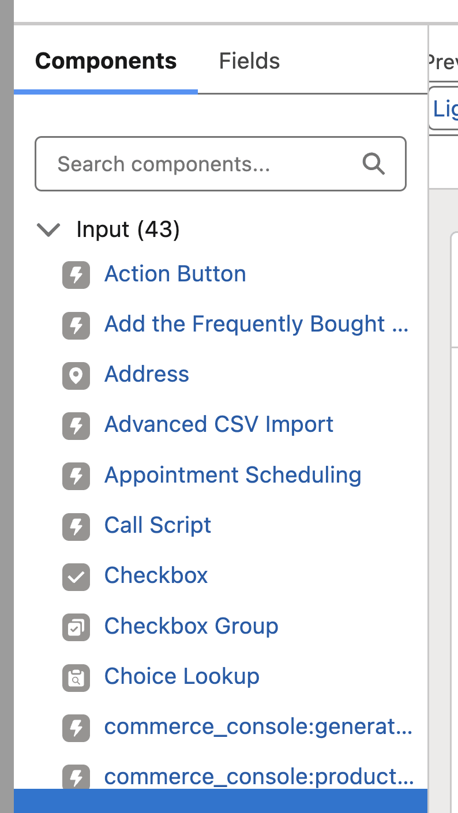
**Description**: Screen Flow components in Flow Builder.

### 32. Constant

**URL**: https://www.salesforceben.com/wp-content/uploads/2023/03/az14.webp
**Local**: 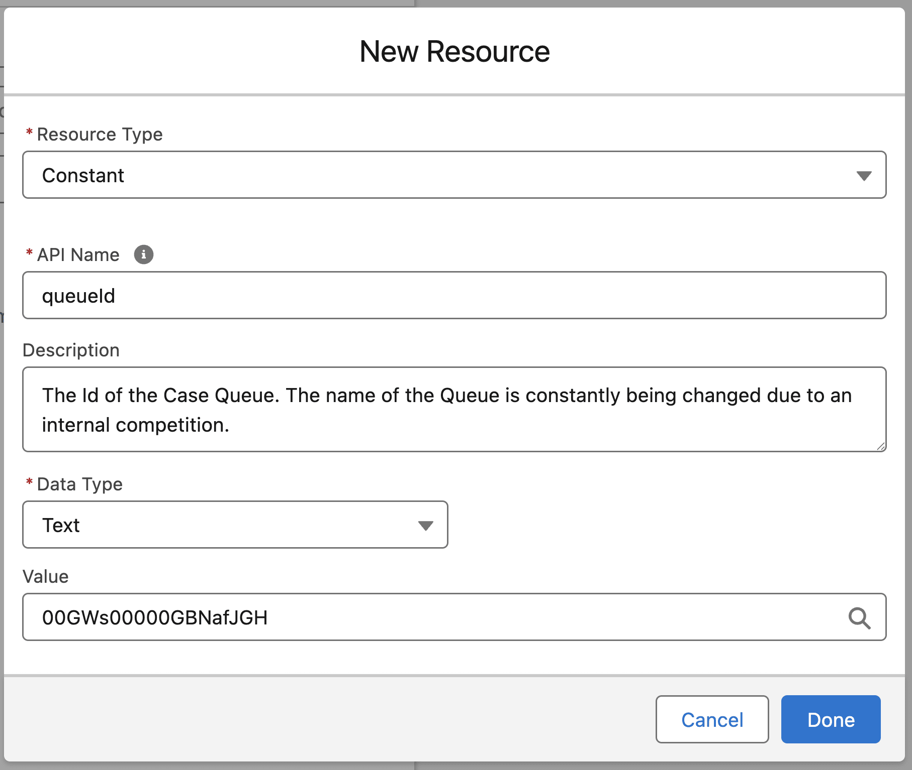
**Description**: Constant resource configuration in Flow Builder.

### 33. Data Table Component

**URL**: https://www.salesforceben.com/wp-content/uploads/2023/03/az15.webp
**Local**: 
**Description**: Data Table component in Screen Flow.

### 34. Debug Tool

**URL**: https://www.salesforceben.com/wp-content/uploads/2023/03/az16.webp
**Local**: 
**Description**: Flow Builder debug interface with execution details.

### 35. Decision Elements

**URL**: https://www.salesforceben.com/wp-content/uploads/2023/03/az17.webp
**Local**: 
**Description**: Decision element configuration with multiple outcomes.

### 36. Drag Selection

**URL**: https://www.salesforceben.com/wp-content/uploads/2023/03/az18.webp
**Local**: 
**Description**: Flow canvas showing drag selection of multiple elements.

### 37. Dynamically Display Elements

**URL**: https://www.salesforceben.com/wp-content/uploads/2023/03/az19-1.webp
**Local**: 
**Description**: Dynamic visibility configuration for screen elements.

### 38. Entry Criteria

**URL**: https://www.salesforceben.com/wp-content/uploads/2023/03/az20.webp
**Local**: 
**Description**: Entry criteria setup for Record-Triggered Flows.

### 39. Error Handling

**URL**: https://www.salesforceben.com/wp-content/uploads/2023/03/az21.webp
**Local**: 
**Description**: Error handling configuration with custom fault paths.

### 40. Errors and Warnings Panel

**URL**: https://www.salesforceben.com/wp-content/uploads/2023/03/az22.webp
**Local**: 
**Description**: Errors and warnings panel in Flow Builder.

### 41. Flow Approvals

**URL**: https://www.salesforceben.com/wp-content/uploads/2023/03/az23.webp
**Local**: 
**Description**: Flow Approvals interface for approval processes.

### 42. Flow Builder Interface

**URL**: https://www.salesforceben.com/wp-content/uploads/2023/03/az24.webp
**Local**: 
**Description**: Main Flow Builder canvas and interface.

### 43. Flow Trigger Explorer

**URL**: https://www.salesforceben.com/wp-content/uploads/2023/03/az25.webp
**Local**: 
**Description**: Flow Trigger Explorer showing execution order.

### 44. Formulas

**URL**: https://www.salesforceben.com/wp-content/uploads/2023/03/az26.webp
**Local**: 
**Description**: Formula resource configuration in Flow Builder.

### 45. Get Records Element

**URL**: https://www.salesforceben.com/wp-content/uploads/2023/03/az27.webp
**Local**: 
**Description**: Get Records element with query configuration.

### 46. Help Text

**URL**: https://www.salesforceben.com/wp-content/uploads/2023/03/az28.webp
**Local**: 
**Description**: Help text configuration for screen components.

### 47. Home Tab

**URL**: https://www.salesforceben.com/wp-content/uploads/2023/03/az29.webp
**Local**: 
**Description**: Automation App home tab with flow overview.

### 48. IdeaExchange

**URL**: https://www.salesforceben.com/wp-content/uploads/2023/03/az30.webp
**Local**: 
**Description**: Salesforce IdeaExchange interface for Flow ideas.

### 49. Input Variables

**URL**: https://www.salesforceben.com/wp-content/uploads/2023/03/az31.webp
**Local**: 
**Description**: Input variable configuration for flows.

### 50. List View

**URL**: https://www.salesforceben.com/wp-content/uploads/2023/03/az32.webp
**Local**: 
**Description**: Custom list view for flow management.

### 51. Loop Variables

**URL**: https://www.salesforceben.com/wp-content/uploads/2023/03/az33.webp
**Local**: 
**Description**: Automatic loop variable creation in loops.

### 52. Migrate to Flow

**URL**: https://www.salesforceben.com/wp-content/uploads/2023/03/az34.webp
**Local**: 
**Description**: Migrate to Flow tool interface.

### 53. Multi-Select Picklist Component

**URL**: https://www.salesforceben.com/wp-content/uploads/2023/03/az35.webp
**Local**: 
**Description**: Multi-select picklist component in Screen Flow.

### 54. Named Credential

**URL**: https://www.salesforceben.com/wp-content/uploads/2023/03/az36-1024x297.webp
**Local**: 
**Description**: Named credential setup for external integrations.

### 55. Navigation Buttons

**URL**: https://www.salesforceben.com/wp-content/uploads/2023/03/az37.webp
**Local**: 
**Description**: Screen Flow navigation button configuration.

### 56. Orchestration Flows

**URL**: https://www.salesforceben.com/wp-content/uploads/2023/03/az38.webp
**Local**: 
**Description**: Flow Orchestration canvas with stages and steps.

### 57. Output Variable

**URL**: https://www.salesforceben.com/wp-content/uploads/2023/03/az39.webp
**Local**: 
**Description**: Output variable configuration.

### 58. Picklist Component

**URL**: https://www.salesforceben.com/wp-content/uploads/2023/03/az40.webp
**Local**: 
**Description**: Picklist component in Screen Flow.

### 59. Platform Event-Triggered Flow

**URL**: https://www.salesforceben.com/wp-content/uploads/2023/03/az42.webp
**Local**: 
**Description**: Platform event flow configuration.

### 60. Process Builder

**URL**: https://www.salesforceben.com/wp-content/uploads/2023/03/az41.webp
**Local**: 
**Description**: Legacy Process Builder interface for comparison.

### 61. Resources

**URL**: https://www.salesforceben.com/wp-content/uploads/2023/03/az43.webp
**Local**: 
**Description**: Resources panel in Flow Builder.

### 62. Retirement Timeline

**URL**: https://www.salesforceben.com/wp-content/uploads/2023/03/az44.webp
**Local**: 
**Description**: Timeline for legacy automation tool retirement.

### 63. Rollback Mode in Flow Debugger

**URL**: https://www.salesforceben.com/wp-content/uploads/2023/03/az45.webp
**Local**: 
**Description**: Debug tool with rollback mode enabled.

### 64. Scheduled-Triggered Flows

**URL**: https://www.salesforceben.com/wp-content/uploads/2023/03/az46.webp
**Local**: 
**Description**: Schedule configuration for time-based flows.

### 65. Screen Flows

**URL**: https://www.salesforceben.com/wp-content/uploads/2023/03/az47.webp
**Local**: 
**Description**: Screen Flow canvas with user interaction elements.

### 66. Send Email Action

**URL**: https://www.salesforceben.com/wp-content/uploads/2023/03/az48.webp
**Local**: 
**Description**: Send Email action configuration.

### 67. Subflows

**URL**: https://www.salesforceben.com/wp-content/uploads/2023/03/az49.webp
**Local**: 
**Description**: Subflow configuration and usage.

### 68. Testing a Flow

**URL**: https://www.salesforceben.com/wp-content/uploads/2023/03/az50.webp
**Local**: 
**Description**: Flow testing interface.

### 69. Toolbox

**URL**: https://www.salesforceben.com/wp-content/uploads/2023/03/az51.webp
**Local**: 
**Description**: Flow Builder toolbox with elements and resources.

### 70. Transform Element

**URL**: https://www.salesforceben.com/wp-content/uploads/2023/03/az52.webp
**Local**: 
**Description**: Transform element for data mapping.

### 71. Update Records Element

**URL**: https://www.salesforceben.com/wp-content/uploads/2023/03/az53.webp
**Local**: 
**Description**: Update Records element configuration.

### 72. Utility Bar

**URL**: https://www.salesforceben.com/wp-content/uploads/2023/03/az54.webp
**Local**: 
**Description**: Utility bar integration for flows.

### 73. Version

**URL**: https://www.salesforceben.com/wp-content/uploads/2023/03/az55.webp
**Local**: 
**Description**: Flow version management interface.

### 74. Visual Picker

**URL**: https://www.salesforceben.com/wp-content/uploads/2023/03/az56.webp
**Local**: 
**Description**: Visual picker component in Screen Flow.

### 75. Wait Element

**URL**: https://www.salesforceben.com/wp-content/uploads/2023/03/az57.webp
**Local**: 
**Description**: Wait element configuration options.

### 76. Workflow Rule

**URL**: https://www.salesforceben.com/wp-content/uploads/2023/03/az58.webp
**Local**: 
**Description**: Legacy Workflow Rule interface for comparison.

## Download Instructions

To download these images manually:

```bash
# Create images subfolder
mkdir -p images

# Download images using curl or wget
curl -o images/flow_types_overview.png "https://www.salesforceben.com/wp-content/uploads/2022/01/flow-types-overview.png"

# Repeat for each image URL listed above
```

Then update this markdown file to use local image references:

```markdown

```

## Notes

- Image URLs may change over time as articles are updated
- Some images may be diagrams created specifically for the articles
- This reference serves as a visual companion to the textual documentation in other files
