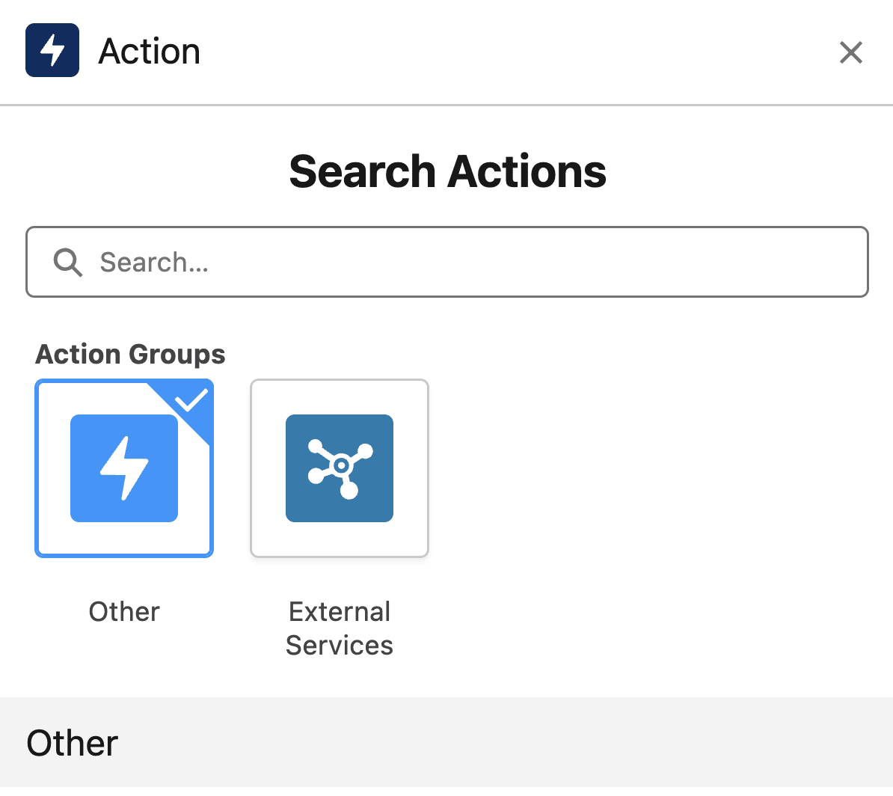

# FlexiRule Rule Builder vs Salesforce Flow Builder: Visual Comparison

## Overview

This document provides a comprehensive visual and functional comparison between FlexiRule's Rule Builder and Salesforce's Flow Builder, highlighting their similarities, differences, and potential areas for cross-pollination of features.

## 1. Interface Layout Comparison

### Salesforce Flow Builder Interface

_Main Flow Builder canvas with toolbox, elements panel, and property editor_

**Key Features:**

- Canvas-based drag-and-drop interface
- Collapsible toolbox with categorized elements
- Property panel for element configuration
- Debug panel integration
- Multi-tab support for complex flows

### FlexiRule Rule Builder Interface

_Vue.js-based rule builder with node-based visual editor_

**Key Features:**

- Node-based graph visualization
- Vue components for different rule elements
- Real-time validation and error display
- Integrated testing and debugging
- Modular component architecture

**Visual Comparison:**
| Aspect | Salesforce Flow Builder | FlexiRule Rule Builder |
|--------|------------------------|----------------------|
| **Canvas Type** | Freeform element placement | Node-graph with connections |
| **Element Style** | Rectangular blocks with icons | Circular/rectangular nodes with labels |
| **Connection Style** | Lines with arrows | Bezier curves with directional arrows |
| **Layout Mode** | Auto-layout vs Freeform | Force-directed graph layout |
| **Zoom/Pan** | Mouse wheel + keyboard shortcuts | Mouse wheel + pan controls |

## 2. Element/Node Palette Comparison

### Salesforce Flow Elements

_Flow Builder toolbox showing categorized elements_

**Categories:**

- **Interaction**: Screen, Action, Subflow
- **Logic**: Decision, Assignment, Transform, Filter, Sort, Loop
- **Data**: Get/Update/Create/Delete Records
- **Utilities**: Wait, Pause, End

### FlexiRule Rule Actions

_Customizable action palette with extensible handler system_

**Categories:**

- **Core Actions**: Condition, Loop, Switch, Set Value, Stop, Raise Error
- **Data Actions**: Query Records, Create Doc, Process Operation
- **Control Actions**: Sub Rule, Entry Action, Notify
- **Custom Actions**: Extensible through Python handlers

**Visual Comparison:**
| Aspect | Salesforce Elements | FlexiRule Actions |
|--------|-------------------|------------------|
| **Visual Style** | Icon + text labels | Text labels with color coding |
| **Grouping** | Categorized tabs | Functional categories |
| **Customization** | Limited built-in options | Fully extensible |
| **Search/Filter** | Basic search | Advanced filtering |
| **Drag Behavior** | Single element drag | Node creation with auto-positioning |

## 3. Canvas and Node Interaction

### Salesforce Flow Canvas

_Flow canvas showing decision branching with multiple outcomes_

**Interaction Features:**

- Click to select elements
- Drag to reposition
- Double-click to edit properties
- Right-click context menu
- Multi-select with Ctrl/Shift
- Auto-connect adjacent elements

### FlexiRule Rule Canvas

_Interactive node graph with real-time connections_

**Interaction Features:**

- Node selection and dragging
- Connection creation by dragging
- Context menus for node actions
- Zoom and pan controls
- Mini-map for navigation
- Keyboard shortcuts for efficiency

**Visual Comparison:**
| Aspect | Salesforce Canvas | FlexiRule Canvas |
|--------|------------------|-----------------|
| **Node Movement** | Free positioning | Physics-based layout |
| **Connection Creation** | Auto-connect + manual | Drag-to-connect |
| **Selection** | Rectangle marquee | Click + modifier keys |
| **Navigation** | Scrollbars + zoom | Pan + zoom controls |
| **Feedback** | Hover tooltips | Real-time validation |

## 4. Property Configuration Comparison

### Salesforce Element Properties

_Element property panel showing configuration options_

**Configuration Style:**

- Tabbed interface (General, Advanced)
- Form-based input fields
- Dropdown selections
- Checkbox toggles
- Resource pickers

### FlexiRule Action Properties

_Dynamic property forms based on action type_

**Configuration Style:**

- JSON-based configuration
- Dynamic field generation
- Type validation
- Conditional fields
- Custom property editors

**Visual Comparison:**
| Aspect | Salesforce Properties | FlexiRule Properties |
|--------|----------------------|---------------------|
| **Layout** | Fixed tabbed panels | Dynamic form generation |
| **Validation** | Real-time with errors | Type-based validation |
| **Extensibility** | Limited to built-in fields | Fully customizable |
| **Persistence** | Auto-save on change | Manual save required |
| **Help Context** | Inline help text | Tooltips and documentation |

## 5. Data Flow Visualization

### Salesforce Data Flow

_Data transformation element showing field mapping_

**Data Flow Features:**

- Visual field mapping interface
- Source-to-target relationship display
- Formula builder for transformations
- Collection handling for bulk operations

### FlexiRule Data Flow

_Context-based data flow through rule execution_

**Data Flow Features:**

- Variable scoping and context passing
- Automatic type inference
- Data transformation actions
- Context visualization in debug mode

**Visual Comparison:**
| Aspect | Salesforce Data Flow | FlexiRule Data Flow |
|--------|---------------------|-------------------|
| **Mapping Interface** | Visual drag-and-drop | Code/text-based configuration |
| **Data Types** | Strongly typed with validation | Dynamic with runtime checking |
| **Bulk Operations** | Collection variables | Array/list handling |
| **Transformation** | Built-in formula builder | Custom handler logic |
| **Visualization** | Direct mapping display | Context inspection |

## 6. Logic and Branching Comparison

### Salesforce Decision Logic

_Decision element with multiple outcome paths_

**Branching Features:**

- Multiple outcomes from single decision
- Visual branching paths
- Outcome labeling
- Complex condition builder

### FlexiRule Logic Branching

_Graph-based branching with conditional execution_

**Branching Features:**

- Node-based conditional execution
- True/False path separation
- Nested condition handling
- Switch-case branching

**Visual Comparison:**
| Aspect | Salesforce Branching | FlexiRule Branching |
|--------|---------------------|-------------------|
| **Branch Type** | Outcome-based | Boolean-based |
| **Visualization** | Labeled paths | Node connections |
| **Complexity** | Multiple outcomes | Binary decisions |
| **Nesting** | Visual grouping | Graph depth |
| **Conditions** | GUI builder | JSON configuration |

## 7. Loop and Iteration Visualization

### Salesforce Loop Elements

_Loop element with automatic variable creation_

**Loop Features:**

- Automatic loop variable creation
- Collection iteration
- Loop control (break/continue)
- Nested loop support

### FlexiRule Loop Actions

_Loop action with configurable iteration_

**Loop Features:**

- Configurable loop parameters
- Context variable iteration
- Loop control through conditions
- Performance monitoring

**Visual Comparison:**
| Aspect | Salesforce Loops | FlexiRule Loops |
|--------|-----------------|----------------|
| **Variable Creation** | Automatic | Manual configuration |
| **Iteration Control** | Built-in controls | Condition-based |
| **Visualization** | Loop boundary box | Loop action node |
| **Performance** | Governor limit aware | Execution monitoring |
| **Nesting** | Visual nesting | Depth tracking |

## 8. Error Handling and Debugging

### Salesforce Debug Mode

_Flow Builder debug panel with execution tracking_

**Debug Features:**

- Step-by-step execution
- Variable value inspection
- Rollback mode for testing
- Error highlighting

### FlexiRule Debugging

_Integrated debugging with execution tracing_

**Debug Features:**

- Execution path visualization
- Context variable inspection
- Error logging and reporting
- Test mode execution

**Visual Comparison:**
| Aspect | Salesforce Debug | FlexiRule Debug |
|--------|-----------------|----------------|
| **Execution View** | Step-by-step panel | Path highlighting |
| **Variable Inspection** | Debug panel | Context viewer |
| **Error Display** | Inline highlighting | Error reporting |
| **Testing Mode** | Rollback enabled | Test execution |
| **Performance** | Governor limit display | Execution metrics |

## 9. Screen and User Interaction

### Salesforce Screen Flows

_Screen Flow with user interaction elements_

**Screen Features:**

- Visual screen designer
- Component palette
- Reactive elements
- Navigation controls
- Input validation

### FlexiRule User Interaction

_Limited user interaction capabilities_

**Screen Features:**

- Basic form generation
- User notification actions
- Limited interactive elements
- External form integration

**Visual Comparison:**
| Aspect | Salesforce Screens | FlexiRule Interaction |
|--------|-------------------|---------------------|
| **Designer** | Visual drag-and-drop | Code-based forms |
| **Components** | Rich component library | Basic notifications |
| **Reactivity** | Built-in reactive updates | Limited dynamic behavior |
| **Validation** | Visual validation rules | Server-side validation |
| **Navigation** | Built-in flow control | External navigation |

## 10. Advanced Features Comparison

### Salesforce Advanced Features

- **Orchestration**: Multi-stage workflows
- **Platform Events**: Event-driven flows
- **Subflows**: Reusable flow components
- **Version Control**: Built-in versioning
- **Integration**: HTTP callouts, Apex actions

### FlexiRule Advanced Features

- **Rule Engine**: Graph-based execution
- **Process Operations**: Higher-level processes
- **Sub-rules**: Nested rule execution
- **Extensible Actions**: Custom handler system
- **Security**: Safe execution context

**Visual Comparison:**
| Feature | Salesforce Implementation | FlexiRule Implementation |
|---------|--------------------------|-------------------------|
| **Orchestration** | Stage-step visual workflow | Process-based operations |
| **Events** | Platform event triggers | Hook-based triggers |
| **Modularity** | Subflow components | Sub-rule nesting |
| **Extensibility** | Apex actions | Python handlers |
| **Security** | Platform security | Safe execution context |

## 11. Performance and Scalability

### Salesforce Performance

- Governor limit monitoring
- Bulk operation optimization
- Asynchronous processing
- Performance profiling

### FlexiRule Performance

- Execution timeout controls
- Cycle detection
- Memory-efficient processing
- Performance metrics

**Visual Comparison:**
| Aspect | Salesforce Performance | FlexiRule Performance |
|--------|-----------------------|----------------------|
| **Limits** | Platform governor limits | Configurable timeouts |
| **Monitoring** | Built-in limit tracking | Execution metrics |
| **Optimization** | Bulkification guidance | Efficient algorithms |
| **Scaling** | Multi-tenant aware | Single-tenant optimized |
| **Debugging** | Performance insights | Execution tracing |

## 12. Architecture and Extensibility

### Salesforce Architecture

- Declarative metadata-driven
- Apex extensibility layer
- Component-based UI
- Platform integration

### FlexiRule Architecture

- Python-based rule engine
- Vue.js frontend
- Handler pattern for actions
- Frappe framework integration

**Visual Comparison:**
| Aspect | Salesforce Architecture | FlexiRule Architecture |
|--------|-------------------------|-----------------------|
| **Backend** | Proprietary platform | Python/Frappe |
| **Frontend** | Lightning Web Components | Vue.js components |
| **Extensibility** | Apex/LWC development | Python handler development |
| **Integration** | Platform APIs | Frappe hooks |
| **Deployment** | Cloud-only | Self-hosted capable |

## Summary: Key Similarities and Differences

### Similarities

- Both provide visual, no-code/low-code automation
- Drag-and-drop interface design
- Conditional logic and branching
- Data manipulation capabilities
- Debug and testing features
- Version control and deployment

### Key Differences

- **Visual Paradigm**: Flow Builder uses element-based canvas; Rule Builder uses node-graph
- **Extensibility**: Rule Builder has deeper custom action capabilities
- **Architecture**: Flow Builder is platform-integrated; Rule Builder is framework-agnostic
- **User Interaction**: Flow Builder has rich screen capabilities; Rule Builder focuses on backend logic
- **Performance**: Flow Builder has platform governor limits; Rule Builder has configurable controls

### Opportunities for Cross-Pollination

**Flow Builder → Rule Builder:**

- Screen component system
- Visual data mapping
- Component styling
- Enhanced debugging UI
- Orchestration workflows

**Rule Builder → Flow Builder:**

- Graph-based visualization
- Extensible action system
- Python-based handlers
- Advanced security model
- Flexible deployment options

This comparison shows that while both tools serve similar purposes, they have distinct visual paradigms and architectural approaches that could benefit from mutual feature adoption.
